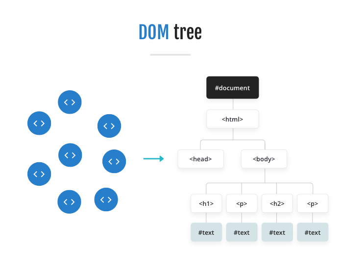
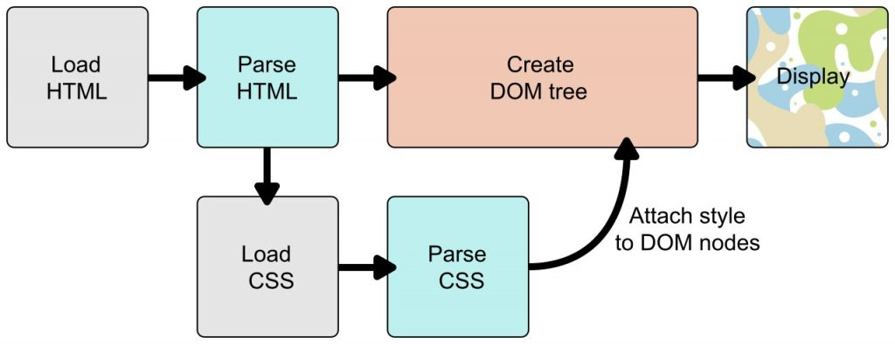

# cour 01 : **Introduction**


## 1. **Introduction**

- **Definition:**

    >**``CSS``** ou ``Cascading Style Sheets`` (Feuilles de style en cascade ), est un langage de style utilisé pour décrire la présentation visuelle des documents HTML (HyperText Markup Language) et XML (eXtensible Markup Language). L'objectif principal de CSS est de séparer la structure du contenu d'un document web de sa présentation, permettant ainsi un contrôle plus précis et flexible sur l'apparence d'une page.

- **Principe:**


    Le principe de CSS est de sélectionner des éléments spécifiques dans une page web pour leur appliquer des styles particuliers. Ce principe repose sur l'utilisation de sélecteurs CSS, qui permettent d'identifier les éléments HTML que vous souhaitez styliser. Une fois que vous avez sélectionné ces éléments, vous pouvez définir des règles de style qui spécifient comment ils doivent être présentés.


- **Syntaxe:**

    La syntaxe générale en CSS suit un modèle de règle simple. Chaque règle se compose d'un sélecteur, de déclarations et de valeurs. Voici un aperçu de la syntaxe CSS :

    ```css
    sélecteur {
    propriété: valeur;
    /* Autres propriétés et valeurs */
    }
    ```

    - **Sélecteur :** Identifie l'élément HTML auquel la règle s'applique. Cela peut être une balise HTML (comme `p` pour les paragraphes), une classe (comme `.maClasse`), ou un identifiant (comme `#monId`), entre autres.

    - **Propriété :** Indique la caractéristique que vous souhaitez styliser (par exemple, `color` pour la couleur du texte, `font-size` pour la taille de la police).

    - **Valeur :** Spécifie la valeur de la propriété que vous souhaitez appliquer (par exemple, `"blue"` pour la couleur du texte, `16px` pour la taille de la police).


- **un exemple concret :**

    ```css
    /* Sélection de balise */
    p {
    color: blue;
    font-size: 16px;
    }

    /* Sélection de classe */
    .maClasse {
    background-color: #eaeaea;
    }

    /* Sélection d'identifiant */
    #monId {
    border: 1px solid black;
    padding: 10px;
    }
    ```

    Dans cet exemple, les règles CSS définissent des styles pour les éléments `p` (paragraphe), les éléments avec la classe `.maClasse`, et l'élément avec l'identifiant `#monId`. Vous pouvez avoir autant de déclarations que nécessaire dans une règle CSS, et vous pouvez regrouper plusieurs règles pour styliser différentes parties de votre document HTML.


## 2. **lien entre ``HTML`` et ``CSS``:**

>Pour lier un fichier CSS à un fichier HTML, vous utilisez la balise `<link>` dans la section `<head>` de votre document HTML. 


- Ajoutez la balise `<link>` dans la section `<head>` de votre fichier HTML. La balise `<link>` doit avoir les attributs `rel` (relation ) et `href` (emplacement du fichier CSS). 


- **un exemple :**

    ```html
    <!DOCTYPE html>
    <html lang="en">
    <head>
    <meta charset="UTF-8">
    <meta name="viewport" content="width=device-width, initial-scale=1.0">
    <title>Ma Page</title>

    <!-- Lien vers le fichier CSS -->
    <link rel="stylesheet" href="styles.css">
    </head>
    <body>
    <!-- Contenu de votre page -->
    </body>
    </html>
    ```

    Dans cet exemple, le fichier CSS "styles.css" est lié à la page HTML. Assurez-vous de spécifier le chemin correct vers votre fichier CSS dans l'attribut `href`. Si le fichier CSS est dans le même répertoire que votre fichier HTML, vous pouvez simplement spécifier le nom du fichier comme dans l'exemple.

    Avec cette liaison, les styles définis dans "styles.css" seront appliqués aux éléments de votre document HTML. Vous pouvez maintenant ajouter vos sélecteurs CSS et définir vos styles dans le fichier "styles.css".


## 3. **Comment le CSS fonctionne t-il ?:**

pour afficher un document, le navigateur va réaliser les principales éléments d'étape suivants : 

1. **Chargement du code HTML :** 
    - Le navigateur commence par récupérer le code HTML en effectuant une requête HTTP vers le serveur. Une fois le HTML obtenu, le navigateur commence à analyser son contenu.

2. **Construction de l'Objet DOM :** 
    - Le navigateur convertit le HTML en un modèle en arbre appelé Document Object Model (DOM). C'est une représentation hiérarchique de tous les éléments HTML de la page, et il est utilisé pour représenter la structure du document.


    


3. **Chargement des ressources, y compris les feuilles de style CSS :** 
    - Le navigateur récupère toutes les ressources mentionnées dans le HTML, telles que les images, les scripts et les feuilles de style CSS, en effectuant des requêtes HTTP supplémentaires si nécessaire.

4. **Analyse du CSS et construction de l'arbre de rendu :** 
    - Le navigateur analyse les feuilles de style CSS pour créer un arbre de rendu. Cet arbre prend en compte les styles à appliquer à chaque élément de la page en fonction des sélecteurs CSS. C'est à ce stade que le navigateur résout les conflits de style, applique les styles en cascade et définit comment chaque élément doit être affiché.

5. **Affichage du document :** 
    - Enfin, le navigateur combine l'arbre DOM avec l'arbre de rendu CSS pour créer un arbre de rendu final. Ce dernier est utilisé pour afficher le document à l'écran, en tenant compte à la fois du HTML et du CSS. La phase de rendu est parfois appelée "peinture" (painting) car elle implique l'affichage visuel de la page.




Il est important de noter que ces étapes ne se produisent pas strictement de manière linéaire, certaines d'entre elles peuvent être réalisées en parallèle pour optimiser les performances. De plus, des mises en cache peuvent être utilisées pour éviter de recharger les ressources déjà téléchargées lors de visites ultérieures sur la même page.


