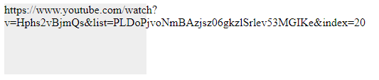

# cour 05 : **Mise en forme texte**


>La mise en forme du texte en CSS permet de personnaliser l'apparence du contenu textuel sur une page web. Elle inclut des propriétés telles que la couleur du texte, la police, la taille, le style (gras, italique), le soulignement, le barré, l'espacement des lettres et des mots, l'alignement, la transformation du texte (majuscules, minuscules), l'espacement des lignes, l'ombre du texte, et d'autres options. Ces propriétés offrent un contrôle précis sur l'esthétique du texte, améliorant ainsi la lisibilité et l'attrait visuel des pages web.


## 1. **Modification de la police de caractères :`font-family`**

- **Description:** 

    >La propriété CSS `font-family` est utilisée pour définir la famille de polices de caractères à utiliser pour afficher le texte dans un élément HTML. Cette propriété spécifie une liste ordonnée de noms de polices ou de types génériques de polices.


- **La syntaxe générale de la propriété `font-family` est la suivante :**

    ```css
    selector {
        font-family: value1, value2, ...;
    }
    ```

    - `selector` : L'élément HTML auquel vous souhaitez appliquer la propriété.
    - `value1`, `value2`, ... : Les noms de polices spécifiques ou les types génériques de polices. Vous pouvez lister plusieurs valeurs en les séparant par des virgules. Si un nom de police contient des espaces, il doit être placé entre guillemets.


- **Exemple d'utilisation :**

    ```css
    body {
        font-family: "Helvetica Neue", Arial, sans-serif;
    }
    ```

    Dans cet exemple, la police "Helvetica Neue" sera utilisée si elle est disponible sur l'ordinateur de l'utilisateur. Sinon, le navigateur utilisera Arial, et en dernier recours, il utilisera une police sans empattement générique (sans-serif).

#### RQ : 

- Il est important de fournir une liste de polices avec des alternatives pour assurer une meilleure compatibilité entre les différents systèmes  et les préférences des utilisateurs. La propriété `font-family` donne aux développeurs une certaine flexibilité pour choisir la meilleure apparence du texte en fonction de la disponibilité des polices sur différents appareils.

- pour plus de fonts : [fonts_google](https://fonts.google.com/)


## 2. **Ajustement de la taille du texte :`font-size`**

- **Description:**

    >La propriété CSS `font-size` est utilisée pour définir la taille du texte dans un élément HTML. Elle spécifie la hauteur du caractère, et vous pouvez définir la taille en utilisant différentes unités telles que pixels (`px`), ems (`em`), pourcentage (`%`), points (`pt`), etc.

- **La syntaxe générale de la propriété `font-size` est la suivante :**

    ```css
    selector {
        font-size: value;
    }
    ```

    - `selector` : L'élément HTML auquel vous souhaitez appliquer la propriété.
    - `value` : La valeur numérique représentant la taille du texte, suivie de l'unité de mesure appropriée.

- **Exemples d'utilisation :**

    ```css
    p {
        font-size: 16px;
    }
    ```

    Dans cet exemple, tous les paragraphes (`<p>`) auront une taille de texte de 16 pixels.

    ```css
    h1 {
        font-size: 2em;
    }
    ```

    Dans cet exemple, toutes les balises `<h1>` auront une taille de texte équivalente à deux fois la taille de texte par défaut de leur parent.

    ```css
    body {
        font-size: 100%;
    }
    ```

    Dans cet exemple, la taille du texte dans le corps (`<body>`) sera définie à 100% de la taille par défaut du navigateur, ce qui est souvent équivalent à 16 pixels.


## 3. **`font-weight`:**

- **Description:**

    >La propriété CSS `font-weight` est utilisée pour définir l'épaisseur ou le poids de la police de caractères (contrôle **la densité visuelle du texte**) d'un élément HTML. Elle permet de spécifier si le texte doit apparaître en caractères gras ou avec une épaisseur normale.


- **La syntaxe générale de la propriété `font-weight` est la suivante :**

    ```css
    selector {
        font-weight: value;
    }
    ```

    - `selector` : L'élément HTML auquel vous souhaitez appliquer la propriété.
    - `value` : La valeur représentant l'épaisseur de la police. Les valeurs courantes sont `normal`, `bold`, ou des valeurs numériques, généralement dans la plage de **``100 à 900``**.


- **Exemples d'utilisation :**

    ```css
    p {
        font-weight: normal;
    }
    ```

    Dans cet exemple, tous les paragraphes (`<p>`) auront une épaisseur de police normale.

    ```css
    h1 {
        font-weight: bold;
    }
    ```

    Dans cet exemple, toutes les balises `<h1>` auront une épaisseur de police en caractères gras.

    ```css
    span {
        font-weight: 600;
    }
    ```

    Dans cet exemple, tous les éléments `<span>` auront une épaisseur de police définie à 600. Les valeurs numériques entre 100 et 900 sont généralement acceptées, où 400 est considéré comme normal et 700 est considéré comme gras.


## 4. **`font-style`:**

- **Description:**

    >La propriété CSS `font-style` est utilisée pour définir le style de la police de caractères d'un élément HTML, notamment pour spécifier s'il doit être affiché en italique.


- **La syntaxe générale de la propriété `font-style` est la suivante :**

    ```css
    selector {
        font-style: value;
    }
    ```

    - `selector` : L'élément HTML auquel vous souhaitez appliquer la propriété.
    - `value` : La valeur représentant le style de la police. Les valeurs courantes sont `normal`, `italic`, ou `oblique`.

- **Exemples d'utilisation :**

    ```css
    p {
        font-style: normal;
    }
    ```

    Dans cet exemple, tous les paragraphes (`<p>`) auront un style de police normal.

    ```css
    em {
        font-style: italic;
    }
    ```

    Dans cet exemple, tous les éléments `<em>` auront un style de police en italique.

    La valeur `oblique` est une alternative à `italic`. Cependant, `oblique` peut être moins pris en charge et n'est pas aussi largement utilisé que `italic`.

    ```css
    blockquote {
        font-style: oblique;
    }
    ```


## 5. **``text-decoration:``**

- **Description:**

    >La propriété CSS `text-decoration` est utilisée pour définir la décoration du texte, telle que le soulignement, le texte barré, ou la suppression de toute décoration. Elle permet de styliser le texte en ajoutant ou en supprimant des lignes ou des traits décoratifs.

    > cette propriété `text-decoration`  est un raccourci qui combine trois propriétés distinctes : `text-decoration-line`, `text-decoration-style`, et `text-decoration-color`. Cela permet de définir la décoration complète du texte en utilisant une seule propriété.


- **La syntaxe :**

    La syntaxe générale de `text-decoration` est la suivante :

    ```css
    selector {
        text-decoration: line style color;
    }
    ```

    - `line` : La ligne de décoration du texte (par exemple, `underline`, `overline`, `line-through`, `none`, etc.).
    - `style` : Le style de la ligne de décoration (par exemple, `solid`, `dashed`, `dotted`, `double`, etc.).
    - `color` : La couleur de la ligne de décoration (une valeur CSS valide pour la couleur).


- **Exemple:**

    ```css
    h2 {
        text-decoration: underline dotted #3366cc;
    }
    ```

    Dans cet exemple, tous les ``h2`` auront un soulignement (`underline`) avec un style en pointillé (`dotted`) de couleur bleu (`#3366cc`).


- **Exemples d'utilisation :**

    - **Pour les liens:**
        Il est courant d'utiliser la propriété `text-decoration` pour styliser les liens en supprimant ou en modifiant l'apparence du soulignement par défaut. 

        ```css
        a {
            text-decoration: none;
        }
        ```
        Dans cet exemple, tous les liens (`<a>`) n'auront aucune décoration de texte, supprimant ainsi tout soulignement par défaut des liens.
        


## 6. **Text Spacing :**

### 6.1 **`letter-spacing`:**

-  **Description:**

    >La propriété CSS `letter-spacing` est utilisée pour définir la distance entre les caractères d'un élément. Elle peut être utilisée pour augmenter ou diminuer l'espace entre les lettres d'un mot ou d'une phrase. 

- **Voici comment vous pouvez l'utiliser :**

    ```css
    /* Exemple : Augmenter l'espace entre les lettres */
    p {
        letter-spacing: 2px; /* Vous pouvez utiliser des valeurs négatives pour rapprocher les lettres */
    }
    ```

    Dans cet exemple, chaque lettre dans les paragraphes (`<p>`) aurait un espacement de 2 pixels.

### 6.2 **`word-spacing`:**

- **Description:**

    >La propriété CSS `word-spacing` est similaire à `letter-spacing`, mais au lieu de régler l'espacement entre les caractères, elle ajuste l'espacement entre les mots d'un élément. 

- **Voici comment vous pouvez l'utiliser :**

    ```css
    /* Exemple : Augmenter l'espace entre les mots */
    p {
        word-spacing: 4px; /* Vous pouvez utiliser des valeurs négatives pour rapprocher les mots */
    }
    ```

    Dans cet exemple, chaque mot dans les paragraphes (`<p>`) aurait un espacement de 4 pixels.


### 6.3 **``text-indent``:**

- **Description:**

    >La propriété `text-indent` est utilisée pour spécifier l'indentation de la première ligne d'un bloc de texte. Elle prend des valeurs numériques ou des unités comme pixels, em, rem, etc. 
    
- **Voici un exemple :**

    ```css
    p {
        text-indent: 20px; /* Indente la première ligne de chaque paragraphe de 20 pixels */
    }
    ```

    Dans cet exemple, la première ligne de chaque paragraphe sera décalée de 20 pixels vers la droite par rapport au reste du texte.


### 6.4 **`line-height`:**

- **Description:**

    >La propriété CSS `line-height` est utilisée pour  spécifie la distance entre les lignes de texte et peut être définie en utilisant des unités telles que pixels, em, rem, pourcentage, etc. ou en utilisant des valeurs spécifiques comme normal.

    >La propriété `line-height` est particulièrement importante pour améliorer la lisibilité du texte et ajuster l'espacement entre les lignes en fonction du style de conception souhaité.


- **Voici quelques exemples :**

    - **Utilisation de pixels :**
    
        ```css
        p {
            line-height: 1.5; /* La hauteur de ligne est 1.5 fois la taille de la police */
        }
        ```

    - **Utilisation de pourcentage :**
    
        ```css
        h1 {
            line-height: 120%; /* La hauteur de ligne est 120% de la taille de la police équivalent à 1.2 */
        }
        ```

    - **Utilisation de la valeur normal :**
    
        ```css
        p {
            line-height: normal; /* La hauteur de ligne est définie par le navigateur, généralement autour de 1.2 */
        }
        ```


### 6.5 **``white-space``:**

- **Description:**

    >La propriété CSS `white-space` est utilisée pour contrôler la gestion des espaces et des sauts de ligne à l'intérieur d'un élément. Elle permet de spécifier comment le contenu d'un élément doit réagir à l'espacement, aux espaces et aux retours à la ligne. 
    
    
- **Voici quelques valeurs courantes pour la propriété `white-space` :**

    1. **`normal` :** C'est la valeur par défaut. Les espaces blancs consécutifs sont réduits à un seul espace et les sauts de ligne sont traités comme un seul espace. Le texte est enveloppé automatiquement au besoin.

        ```html
        <div>CSS CSS CSS CSS CSSHTML CSS CSS CSS CSS</div>

        ```
        ```css
        div {
            white-space: normal;
        }
        ```
        

    2. **`nowrap` :** Le texte ne sera pas enveloppé, même s'il dépasse la largeur de son conteneur. Les sauts de ligne sont ignorés.

        ```css
        p {
            white-space: nowrap;
        }
        ```
        

- **Utilisation en pratique:**

    - Utilisation en pratique de ``white-space`` : dans le cas où l'on a un titre dans une div qui dépasse la taille de la div, plutôt que de laisser le contenu du titre se déborder vers le bas, ce qui pourrait rendre le design peu esthétique, on préfère utiliser la valeur nowrap et ajouter trois points (...) pour indiquer qu'il reste une partie non affichée.


### 6.6 **``word-break``:**

- **Description:**

    >La propriété CSS `word-break` est utilisée pour spécifier comment les lignes doivent être coupées lorsqu'un **``mot``** ne tient pas entièrement sur une ligne. Cette propriété est souvent utilisée dans des situations où un mot est trop long pour s'ajuster à la largeur d'un conteneur.

    >La propriété `word-break` est utile dans des situations multilingues ou lorsque vous devez gérer des mots longs qui pourraient affecter la mise en page de votre contenu. Vous pouvez l'utiliser pour contrôler le comportement des coupures de mots en fonction de vos besoins spécifiques.

- **Voici quelques valeurs courantes pour la propriété `word-break` :**

    1. **`normal` :** C'est la valeur par défaut. Les mots longs peuvent déborder du conteneur.

        ```css
        div{
            word-break: normal;
        }
        ```
        

    2. **`break-all` :** Les mots longs peuvent être coupés et continuer sur la ligne suivante.

        ```css
        div {
            word-break: break-all;
        }
        ```
        


## 7. **Alignement du texte :`text-align`**

- **Description:**

    >La propriété CSS `text-align` est utilisée pour définir l'alignement horizontal du texte à l'intérieur d'un élément HTML. Elle permet de spécifier si le texte doit être aligné à gauche, à droite, au centre ou justifié.


- **La syntaxe générale de la propriété `text-align` est la suivante :**

    ```css
    selector {
        text-align: value;
    }
    ```

    - `selector` : L'élément HTML auquel vous souhaitez appliquer la propriété.
    - `value` : La valeur représentant l'alignement horizontal du texte. Les valeurs courantes incluent `left` (gauche), `right` (droite), `center` (centre), et `justify` (justifié).

- **Exemples d'utilisation :**

    ```css
    p {
        text-align: left;
    }
    ```

    Dans cet exemple, tous les paragraphes (`<p>`) auront leur texte aligné à gauche.

    ```css
    h1 {
        text-align: right;
    }
    ```

    Dans cet exemple, toutes les balises `<h1>` auront leur texte aligné à droite.

    ```css
    div {
        text-align: center;
    }
    ```

    Dans cet exemple, tous les éléments `<div>` auront leur texte centré horizontalement.

    ```css
    blockquote {
        text-align: justify;
    }
    ```

    Dans cet exemple, tous les éléments `<blockquote>` auront leur texte justifié, ce qui signifie que l'espace entre les mots sera ajusté pour occuper toute la largeur de l'élément.


## 8. **Transformation du texte :`text-transform`**

- **Description:**

    >La propriété CSS `text-transform` est utilisée pour spécifier comment le texte doit être transformé en termes de casse (majuscules ou minuscules). Elle permet de modifier la capitalisation des caractères dans le texte d'un élément HTML.

- **La syntaxe générale de la propriété `text-transform` est la suivante :**

    ```css
    selector {
        text-transform: value;
    }
    ```

    - `selector` : L'élément HTML auquel vous souhaitez appliquer la propriété.
    - `value` : La valeur représentant le mode de transformation du texte. Les valeurs courantes incluent `uppercase` (tout en majuscules), `lowercase` (tout en minuscules), `capitalize` (la première lettre de chaque mot en majuscule), et `none` (pas de transformation).


- **Exemples d'utilisation :**

    ```css
    p {
        text-transform: uppercase;
    }
    ```

    Dans cet exemple, tous les paragraphes (`<p>`) auront leur texte transformé en majuscules.

    ```css
    h2 {
        text-transform: lowercase;
    }
    ```

    Dans cet exemple, toutes les balises `<h2>` auront leur texte transformé en minuscules.

    ```css
    span {
        text-transform: capitalize;
    }
    ```

    Dans cet exemple, tous les éléments `<span>` auront leur texte avec la première lettre de chaque mot en majuscule.


## 9. **Ombre du texte : `text-shadow`**

- **Description:**

    >La propriété CSS `text-shadow` est utilisée pour ajouter une ombre au texte à l'intérieur d'un élément. Elle permet de créer des effets visuels intéressants en donnant une dimension tridimensionnelle ou un contraste au texte par rapport à son arrière-plan. 
    
    
- **La syntaxe de la propriété `text-shadow` est la suivante :**

    ```css
    text-shadow: h-shadow v-shadow blur-radius color;
    ```

    - `h-shadow` : Déplacement horizontal de l'ombre. Une valeur positive déplace l'ombre vers la droite, et une valeur négative vers la gauche.

    - `v-shadow` : Déplacement vertical de l'ombre. Une valeur positive déplace l'ombre vers le bas, et une valeur négative vers le haut.

    - `blur-radius` : Optionnel. Indique le flou de l'ombre. Plus la valeur est grande, plus l'ombre est floue. Si omis, l'ombre est nette.

    - `color` : Couleur de l'ombre. Elle peut être spécifiée par un nom de couleur, un code hexadécimal ou une valeur RGB.


- **Exemple :**

    ```css
    .texte-ombre {
        text-shadow: 2px 2px 4px #000000;
    }
    ```

    Dans cet exemple, le texte avec la classe `.texte-ombre` aura une ombre légèrement décalée vers la droite et vers le bas, avec un flou de 4 pixels, et de couleur noire. Cette propriété est souvent utilisée pour améliorer la lisibilité du texte ou pour ajouter des effets esthétiques au design d'une page web.

    


## 10. **Text direction:**

- **Description:**

    >En CSS, la propriété ``direction`` est utilisée pour spécifier la direction du texte dans un élément.  La propriété ``direction`` peut être appliquée à n'importe quel élément HTML, mais elle a souvent plus d'impact sur les éléments qui contiennent du texte, comme les paragraphes (`<p>`), les divs (`<div>`), etc.
    
- **les valeurs:**

    1. **ltr (left-to-right)** : Cette valeur spécifie que le texte doit être affiché de gauche à droite. C'est la valeur par défaut pour la plupart des langues occidentales.

        Exemple :
        ```css
        p {
            direction: ltr;
        }
        ```

    2. **rtl (right-to-left)** : Cette valeur spécifie que le texte doit être affiché de droite à gauche. Elle est généralement utilisée pour les langues comme l'**arabe** ou l'hébreu.

        Exemple :
        ```css
        div {
            direction: rtl;
        }
        ```

- **Exemples:**

    ```html
    <body>
        <div>و عليكم السلام.</div>
    </body>
    ```

    ```css
    /* */
    div {
        background-color: #DDD ;
        text-align: center;
        direction: rtl;
    }
    ```
    - **``dircetion=ltr``**    
        

    - **``dircetion=rtl``**    
        


## 11.**La propriété `vertical-align`:**

- **Description:**
    
    >La propriété `vertical-align` en CSS est utilisée pour spécifier la façon dont le contenu en ligne (comme du texte ou des images) est aligné verticalement par rapport à son conteneur ou à un autre élément en ligne adjacent. On peut contrôler cela grâce à cette propriété en accédant à l'image pu span par exemple

- **valeurs de La propriété `vertical-align` :**

    La propriété `vertical-align` en CSS accepte différentes valeurs pour spécifier comment un élément en ligne doit être aligné verticalement par rapport à son conteneur ou à d'autres éléments adjacents. Voici une explication des valeurs les plus couramment utilisées : `top`, `bottom` et `middle` :

    1. **`top`** : Aligne l'élément en haut de la ligne de base de son conteneur. Par exemple :
        ```css
        img {
            vertical-align: top;
        }
        ```

    2. **`bottom`** : Aligne l'élément en bas de la ligne de base de son conteneur. Par exemple :
        ```css
        img {
            vertical-align: bottom;
        }
        ```

    3. **`middle`** : Aligne l'élément au milieu de la hauteur de la ligne. Par exemple :
        ```css
        img {
            vertical-align: middle;
        }
        ```


- **Voici quelques exemples de son utilisation :**

    1. **Pour aligner du texte dans une ligne** :
        ```css
        span {
            vertical-align: middle; /* Aligne le texte au milieu de la ligne par rapport à le contenu du span*/

        }
        ```
        

    2. **Pour aligner une image par rapport à du texte** :
        ```css
        img {
            vertical-align: middle; /* Aligne l'image au milieu de la ligne par rapport au texte */
        }
        ```

        

        

#### RQ : 

- Il est important de noter que l'effet de ces valeurs peut varier en fonction du contexte dans lequel `vertical-align` est utilisé. Par exemple, lorsqu'elle est utilisée avec des images à l'intérieur d'une ligne de texte, ces valeurs ajusteront la position de l'image par rapport à la ligne de texte. Dans d'autres contextes, comme les cellules de tableau, elles peuvent ajuster la position par rapport à la cellule.


## 12. **``text-overflow``:**

- **Description:**

    >La propriété CSS `text-overflow` est utilisée pour spécifier comment le contenu débordant d'un conteneur avec une taille fixe doit être géré. Cette propriété est souvent utilisée avec la propriété `overflow` et `white-space` pour créer un effet d'ellipse (...) pour indiquer qu'il y a du contenu supplémentaire qui ne rentre pas dans le conteneur visible.


- **Voici un exemple d'utilisation de la propriété `text-overflow: ellipsis;` :**

    ```css
    .overflow-example {
        white-space: nowrap; /* Empêche le texte de passer à la ligne */
        overflow: hidden; /* Masque le contenu débordant */
        text-overflow: ellipsis; /* Ajoute les points de suspension (...) pour indiquer le débordement du texte */
        width: 200px; /* Largeur fixe du conteneur */
    }
    ```

    Dans cet exemple, le texte à l'intérieur de l'élément avec la classe `overflow-example` ne sera pas autorisé à passer à la ligne (`white-space: nowrap;`), et le contenu débordant sera masqué (`overflow: hidden;`). Si le texte dépasse la largeur spécifiée de 200 pixels, des points de suspension seront ajoutés à la fin du texte pour indiquer qu'il y a du contenu non visible (`text-overflow: ellipsis;`).

    