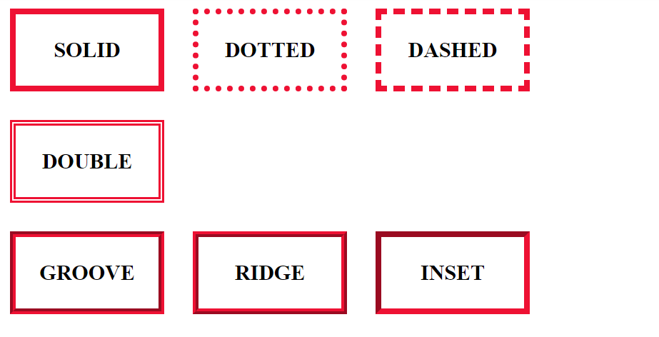
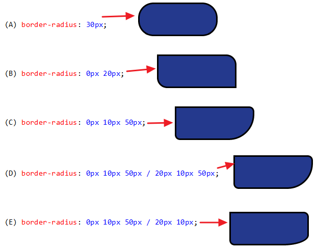

# cour 11 : **``Bordures``**

## 1. **Introduction:**

Les bordures en CSS sont des éléments cruciaux pour la mise en page et le design d'une page web, permettant aux développeurs de définir la présentation visuelle des contours des éléments HTML. Les bordures ajoutent des détails stylistiques et structurels, améliorant ainsi l'apparence globale de l'interface utilisateur.

La propriété CSS principale utilisée pour définir les bordures est simplement appelée ``border``. Elle offre un contrôle complet sur la couleur, l'épaisseur, le style et le rayon de courbure des bordures. 

- **Voici un exemple simple de définition d'une bordure :**

    ```css
    .element {
        border: 2px solid #3498db; /* Bordure de 2 pixels, style solide, couleur bleue */
    }
    ```

    Dans cet exemple, l'élément avec la classe "element" aurait une bordure de 2 pixels d'épaisseur, de style solide, et de couleur bleue. Cependant, la propriété "border" peut être décomposée en plusieurs sous-propriétés pour un contrôle plus précis :

    - `border-width`: Définit l'épaisseur de la bordure.
    - `border-style`: Définit le style de la bordure (solide, pointillé, en relief, etc.).
    - `border-color`: Définit la couleur de la bordure.


## 2. **Les propriétés `border-*`:**


### 2.1 **La propriété `border-width`:**

- **Déscription:**

    >La propriété `border-width` en CSS est utilisée pour définir l'épaisseur des bordures d'un élément HTML. Cette propriété peut être utilisée pour spécifier l'épaisseur des quatre côtés d'un élément (haut, droite, bas, gauche) individuellement, ou pour définir la même épaisseur pour tous les côtés en une seule déclaration.


- **Voici comment vous pouvez utiliser `border-width` :**

    1. **Épaisseur pour tous les côtés :**

        ```css
        .element {
            border-width: 2px; /* Épaisseur de la bordure de 2 pixels pour tous les côtés */
        }
        ```

    2. **Épaisseur individuelle pour chaque côté :**

        ```css
        .element {
            border-width: 2px 4px 6px 8px; /* Épaisseur de la bordure pour le haut, la droite, le bas et la gauche respectivement */
        }
        ```

        Cela indique que le côté supérieur (haut) aura une bordure de 2 pixels, le côté droit de 4 pixels, le côté inférieur (bas) de 6 pixels, et le côté gauche de 8 pixels.

    3. **Épaisseur pour des côtés spécifiques :**

        Vous pouvez également spécifier l'épaisseur individuelle pour un ou plusieurs côtés en utilisant les propriétés spécifiques, par exemple `border-top-width`, `border-right-width`, `border-bottom-width`, `border-left-width` :

        ```css
        .element {
            border-top-width: 2px;
            border-right-width: 4px;
            border-bottom-width: 6px;
            border-left-width: 8px;
        }
        ```

        Cela permet de définir l'épaisseur de chaque côté séparément.


- **Les mots-clés `medium`, `thin`, et `thick`:**

    >Les mots-clés `medium`, `thin`, et `thick` sont des valeurs prédéfinies pour la propriété `border-width` en CSS, et ils sont utilisés pour définir l'épaisseur des bordures d'un élément. Cependant, ces valeurs ne sont pas toujours recommandées car elles peuvent varier légèrement d'un navigateur à l'autre, et il est souvent préférable d'utiliser des valeurs spécifiques en pixels, en pourcentage, ou dans d'autres unités pour un contrôle plus précis.

    1. **`medium` :** C'est la valeur par défaut pour `border-width`. Sa signification exacte dépend du navigateur, mais généralement, elle représente une épaisseur de bordure moyenne.

        ```css
        .element {
            border-width: medium;
        }
        ```

    2. **`thin` :** Utilisé pour définir une bordure plus fine que la valeur par défaut.

        ```css
        .element {
            border-width: thin;
        }
        ```

    3. **`thick` :** Utilisé pour définir une bordure plus épaisse que la valeur par défaut.

        ```css
        .element {
            border-width: thick;
        }
        ```

L'épaisseur de la bordure peut être exprimée en pixels, en pourcentage, en em ou d'autres unités de mesure. La propriété `border-width` est souvent utilisée en combinaison avec d'autres propriétés de la famille `border`, telles que `border-style` pour définir le style de la bordure, et `border-color` pour définir la couleur de la bordure.


### 2.2 **La propriété `border-style`:**

- **Description:**
    
    >La propriété `border-style` en CSS est utilisée pour définir le style des bordures d'un élément HTML. Elle permet de spécifier le motif ou la texture de la bordure qui encadre un élément. 
    
- **Voici quelques valeurs courantes pour la propriété `border-style` :**

    - **`none` :** Aucune bordure. Aucun style n'est appliqué.

        ```css
        .element {
            border-style: none;
        }
        ```

    - **`solid` :** Une ligne pleine (continue) comme bordure.

        ```css
        .element {
            border-style: solid;
        }
        ```

    - **`dashed` :** Une ligne composée de segments de traits et d'espaces.

        ```css
        .element {
            border-style: dashed;
        }
        ```

    - **`dotted` :** Une ligne composée de points.

        ```css
        .element {
            border-style: dotted;
        }
        ```

    - **`double` :** Deux lignes parallèles pleines.

        ```css
        .element {
            border-style: double;
        }
        ```

    - **`groove` :** Un effet en 3D qui donne l'impression que la bordure est enfoncée dans la page.

        ```css
        .element {
            border-style: groove;
        }
        ```

    - **`ridge` :** Un effet en 3D qui donne l'impression que la bordure ressort de la page.

        ```css
        .element {
            border-style: ridge;
        }
        ```

- Il existe d'autres valeurs telles que `inset`, `outset`, etc., qui donnent également des effets 3D à la bordure. Vous pouvez également utiliser `border-style` pour définir différents styles pour chaque côté de l'élément en utilisant les propriétés spécifiques comme `border-top-style`, `border-right-style`, `border-bottom-style`, et `border-left-style`.





- **Exemple avec des styles spécifiques pour chaque côté :**

    ```css
    .element {
    border-top-style: solid;
    border-right-style: dashed;
    border-bottom-style: dotted;
    border-left-style: double;
    }
    ```

    En combinant `border-width`, `border-style`, et `border-color`, vous pouvez personnaliser complètement l'apparence des bordures d'un élément HTML.

### 2.3 **La propriété `border-color`:**

- **Description:**

    >La propriété `border-color` en CSS est utilisée pour définir la couleur des bordures d'un élément HTML. Elle permet de spécifier la couleur de chaque côté de la bordure individuellement ou d'appliquer une couleur uniforme à tous les côtés en une seule déclaration. 
    
    
- **Voici comment vous pouvez utiliser `border-color` :**

    1. **Couleur uniforme pour tous les côtés :**

        ```css
        .element {
            border-color: #3498db; /* Couleur bleue pour tous les côtés */
        }
        ```

    2. **Couleurs individuelles pour chaque côté :**

        ```css
        .element {
            border-top-color: #3498db; /* Couleur bleue pour le côté supérieur (haut) */
            border-right-color: #2ecc71; /* Couleur verte pour le côté droit */
            border-bottom-color: #e74c3c; /* Couleur rouge pour le côté inférieur (bas) */
            border-left-color: #f39c12; /* Couleur orange pour le côté gauche */
        }
        ```

        Vous pouvez également utiliser la syntaxe abrégée en spécifiant toutes les couleurs dans un seul `border-color`, séparées par des espaces ou des virgules. Par exemple :

        ```css
        .element {
            border-color: #3498db #2ecc71 #e74c3c #f39c12; /* Bleu, vert, rouge, orange pour les côtés respectifs */
        }
        ```

### 2.4 **La propriété `border-radius`:**

- **Description:**
    
    >La propriété `border-radius` en CSS est utilisée pour définir la courbure des coins des éléments HTML, ce qui permet de créer des coins arrondis ou elliptiques. Cette propriété peut être appliquée à tous les côtés d'un élément ou à chaque côté individuellement.

- **Voici comment utiliser la propriété `border-radius` de manière générale :**

    ```css
    .element {
    border-radius: 10px; /* Courbure de 10 pixels pour tous les coins */
    }
    ```

    Dans cet exemple, tous les coins de l'élément avec la classe "element" auraient une courbure de 10 pixels. Vous pouvez également spécifier différentes valeurs pour chaque coin individuellement, en utilisant la notation pour les quatre coins :

    ```css
    .element {
    border-radius: 10px 20px 30px 40px;
    /* Courbure de 10 pixels pour le coin supérieur gauche,
        20 pixels pour le coin supérieur droit,
        30 pixels pour le coin inférieur droit,
        40 pixels pour le coin inférieur gauche */
    }
    ```

    Il est également possible d'utiliser des valeurs spécifiques pour définir la courbure horizontale et verticale séparément :

    ```css
    .element {
    border-radius: 20px 30px; /* Courbure de 20 pixels horizontalement, 30 pixels verticalement */
    }
    ```

    La propriété `border-radius` peut également accepter des valeurs en pourcentage, ce qui peut être utile pour créer des coins arrondis proportionnels à la taille de l'élément.

    ```css
    .element {
    border-radius: 10%; /* Courbure de 10% pour tous les coins */
    }
    ```

- **Exemple:**

    

#### RQ :

- si``width=height`` et ``border-raduis: 50%``  => cercel

## 3. **Le raccourci `border`:**

- **Description:**

    >Le raccourci `border` en CSS permet de définir plusieurs propriétés liées aux bordures d'un élément en une seule déclaration. Ce raccourci peut regrouper plusieurs sous-propriétés, telles que `border-width`, `border-style`, et `border-color`. 
    
    
- **Voici la syntaxe générale du raccourci `border` :**

    ```css
    .element {
        border: [width] [style] [color];
    }
    ```

    Vous pouvez choisir de spécifier une, deux ou trois des sous-propriétés mentionnées ci-dessus, dans l'ordre indiqué. 


- **Voici quelques exemples pour illustrer l'utilisation du raccourci `border` :**

    ```css
    .element {
      border: 2px dotted #e74c3c; /* Épaisseur de 2 pixels, style en pointillés, couleur rouge */
    }
    ```

En utilisant le raccourci `border`, vous pouvez rendre le code CSS plus lisible et plus concis en spécifiant plusieurs propriétés en une seule ligne. Cependant, il est important de noter que l'ordre des valeurs doit être respecté pour que le raccourci fonctionne correctement.
