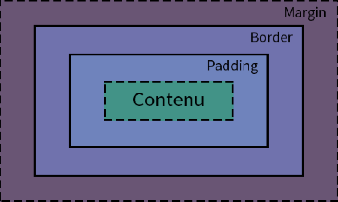
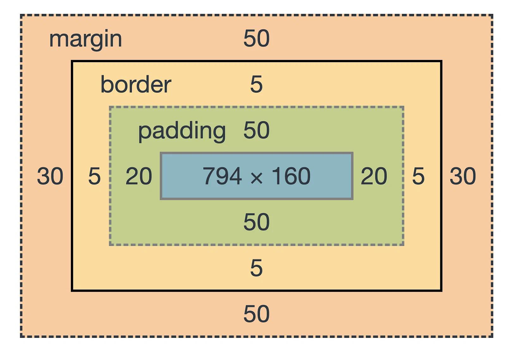

# cour : **Modéle de Boite**

## 1. **Introduction:**

- Le modèle de boîte en CSS est un concept fondamental qui régit la disposition et la présentation des éléments HTML sur une page web. Chaque élément HTML est considéré comme une boîte rectangulaire, et le modèle de boîte définit comment cette boîte est structurée, dimensionnée, et comment son contenu est disposé à l'intérieur.


- Le modèle de boîte en CSS est composé de quatre parties principales :

    1. **Contenu (Content) :** Il s'agit de la zone intérieure de la boîte, qui contient le contenu réel de l'élément (texte, images, etc.).

    2. **Padding:** C'est la zone entre le contenu et la bordure. padding ajoute de l'espace à l'intérieur de la boîte pour séparer le contenu de la bordure.

    3. **Bordure (Border) :** La bordure entoure le padding et délimite visuellement la boîte. Elle peut avoir une épaisseur, un style (solide, pointillé, etc.) et une couleur spécifiés.

    4. **Marge (Margin) :** La marge est l'espace situé à l'extérieur de la bordure. Elle crée de l'espace entre la boîte et les autres éléments sur la page.








- **Voici un exemple de CSS basique qui utilise le modèle de boîte pour définir une boîte simple :**

    ```css
    .element {
    width: 200px; /* Largeur de la boîte */
    height: 100px; /* Hauteur de la boîte */
    padding: 20px; /* padding à l'intérieur de la boîte */
    border: 2px solid #3498db; /* Bordure de 2 pixels, style solide, couleur bleue */
    margin: 10px; /* Marge à l'extérieur de la boîte */
    }
    ```

    Ce CSS s'applique à un élément avec la classe "element" et crée une boîte rectangulaire avec une largeur de 200 pixels, une hauteur de 100 pixels, une bordure bleue de 2 pixels d'épaisseur, un padding intérieur de 20 pixels, et une marge extérieure de 10 pixels. Cela illustre comment les différentes parties du modèle de boîte interagissent pour définir l'apparence d'un élément sur une page web.


## 2. **``padding``**

- **Description:**

    >La propriété `padding` en CSS est utilisée pour définir l'espace entre le contenu d'un élément HTML et sa bordure. Elle permet d'ajouter de l'espace intérieur à une boîte, ce qui est particulièrement utile pour améliorer la lisibilité et la présentation du contenu.

- **La syntaxe de base de la propriété `padding` est la suivante :**

    ```css
    .element {
        padding: valeur;
    }
    ```

    Vous pouvez spécifier une valeur unique pour appliquer le même padding à tous les côtés, ou vous pouvez utiliser la notation abrégée pour spécifier le padding pour chaque côté individuellement. 
    
- **Voici quelques exemples :**

    1. **Padding uniforme :**

        ```css
        .element {
            padding: 10px; /* Padding de 10 pixels pour tous les côtés */
        }
        ```

    2. **Padding individuel :**

        ```css
        .element {
            padding-top: 10px;
            padding-right: 20px;
            padding-bottom: 15px;
            padding-left: 5px;
        }
        ```

        Ou en utilisant la notation abrégée :

        ```css
        .element {
            padding: 10px 20px 15px 5px; /* Haut, Droite, Bas, Gauche */
        }
        ```

La propriété `padding` peut également accepter des valeurs en pourcentage, en em, en rem, etc.


## 3.**``margin:``**

- **Description:**

    >La propriété `margin` en CSS est utilisée pour définir l'espace entre la bordure d'un élément HTML et les éléments adjacents (autres éléments sur la page). Elle permet de créer de l'espace extérieur autour d'une boîte.


- **La syntaxe de la propriété `margin` :**

    ```css
    .element {
        margin: valeur;
    }
    ```

    Vous pouvez spécifier une valeur unique pour appliquer la même marge à tous les côtés, ou utiliser la notation abrégée pour spécifier la marge pour chaque côté individuellement. 
    
- **Voici quelques exemples :**

    1. **Marge uniforme :**

        ```css
        .element {
            margin: 10px; /* Marge de 10 pixels pour tous les côtés */
        }
        ```

    2. **Marge individuelle :**

        ```css
        .element {
            margin-top: 10px;
            margin-right: 20px;
            margin-bottom: 15px;
            margin-left: 5px;
        }
        ```

        Ou en utilisant la notation abrégée :

        ```css
        .element {
            margin: 10px 20px 15px 5px; /* Haut, Droite, Bas, Gauche */
        }
        ```

- **La valeur `auto`:**

    >La valeur `auto` pour la propriété `margin` en CSS est utilisée pour centrer horizontalement un bloc ou un élément à l'intérieur de son contenant. Lorsque la valeur `auto` est spécifiée pour les marges horizontales (gauche et droite), elle répartit l'espace disponible de manière égale de chaque côté de l'élément, ce qui a pour effet de le centrer horizontalement.

    
    - Voici comment vous pouvez utiliser la valeur `auto` pour centrer horizontalement un élément :

        ```css
        .element {
            width: 70%;
            margin-left: auto;
            margin-right: auto;
        }
        ```

        Ou en utilisant la notation abrégée :

        ```css
        .element {
            margin: 0 auto; /* 0 pour la marge supérieure et inférieure, auto pour la marge gauche et droite */
        }
        ```

- **la fusion des merges:**

    >Lorsque deux éléments avec des marges se touchent, la marge résultante entre eux est  celle qui a la plus grande valeur (maximale) parmi les deux marges.Cela est souvent appelé la "fusion des marges" et c'est un comportement standard dans le modèle de boîte en CSS. Voici un exemple pour illustrer cela :

    ```css
    .element1 {
    margin-bottom: 20px;
    }

    .element2 {
    margin-top: 30px;
    }
    ```

    Si ces deux éléments sont l'un en dessous de l'autre dans le flux normal du document, la marge effective entre eux serait de 30 pixels, car c'est la plus grande des deux valeurs.

- **Débordement de la margin:**
    
    - Dans une  une situation où un élément enfant a une `margin-top` non nulle, mais le parent n'a pas de `margin`, on observe un comportement où la marge de l'enfant semble se déborder. Cela peut se produire en raison du phénomène de la fusion des marges en CSS, même si le parent n'a pas de marge. Lorsque l'enfant a une `margin-top` non nulle, cette marge peut fusionner avec la marge du parent, créant un débordement de marge indésirable.

    
    - Une façon de résoudre ce problème est d'ajouter une bordure ou un `padding` minime au parent. Cela empêchera la fusion des marges entre le parent et l'enfant. Voici un exemple :

        ```html
        <div class="parent">
        <p class="child">Contenu du paragraphe</p>
        </div>
        ```

        ```css
        .parent {
        /* Ajout d'une bordure ou d'un padding minime pour éviter le débordement de marge */
        border: 1px solid transparent;
        }

        .child {
        margin-top: 30px;
        }
        ```

        En ajoutant une bordure ou un `padding` au parent, vous créez une barrière qui empêche la fusion des marges entre l'enfant et le parent. Cela peut être particulièrement utile lorsque le parent n'a pas de marges délibérément, mais que vous souhaitez éviter le comportement de débordement de marge.
        


## 4. **``box-sizing``:**

- **Description:**

    >La propriété `box-sizing` en CSS est utilisée pour définir la boîte de modélisation utilisée pour calculer la largeur et la hauteur totales d'un élément. Elle peut prendre l'une des deux valeurs principales : `content-box` ou `border-box`.

1. **`content-box` (valeur par défaut) :** 
    
    >La largeur et la hauteur de l'élément sont calculées en tenant compte uniquement du contenu, c'est-à-dire la zone à l'intérieur de la bordure. Les propriétés `width` et `height` définissent la taille du contenu de l'élément, et la bordure, le remplissage (padding)  s'ajoutent à cette taille.

   - **Exemple :**

   ```css
   .box {
     width: 100px;
     height: 100px;
     padding: 10px;
     border: 2px solid #3498db;
     box-sizing: content-box;
   }
   ```

   Dans cet exemple, la largeur totale de l'élément sera de 124 pixels (100px pour le contenu + 2x10px pour le padding + 2x2px pour la bordure).

2. **`border-box` :** 
    
    >La largeur et la hauteur de l'élément incluent la bordure et le remplissage (padding). Cela signifie que la taille définie par les propriétés `width` et `height` comprend également la bordure et le padding.

   - **Exemple :**

    ```css
    .box {
        width: 100px;
        height: 100px;
        padding: 10px;
        border: 2px solid #3498db;
        box-sizing: border-box;
    }
    ```

   Dans cet exemple, la largeur totale de l'élément sera de 100 pixels (définie par la propriété `width`), et la hauteur totale sera également de 100 pixels (définie par la propriété `height`). La bordure et le padding sont inclus dans la taille totale.

