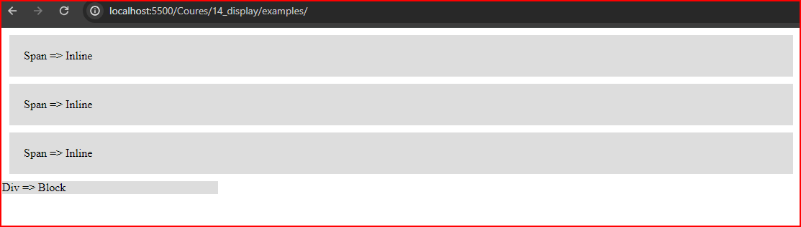
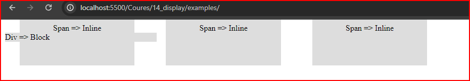
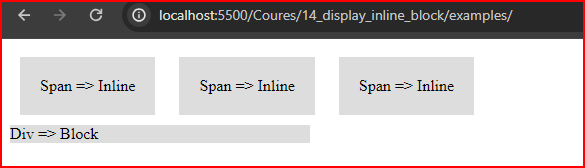

# cour 14 : **``display``**


## 1. **Description:**

   >La propriété CSS `display` permet de définir le mode d'affichage d'un élément HTML, influençant ainsi son rendu en termes d'aspect "inline" ou "block". Cette propriété joue un rôle crucial dans la gestion de la disposition des éléments sur une page web, offrant un contrôle précis sur la manière dont ils occupent l'espace et interagissent les uns avec les autres.

 


## 2. **Les valeurs:``inline`` , ``block`` , ``inline-block``**


### 2.1. **`block`**: 

- **Caractéristiques:** 

   - L'élément de type ``block`` en HTML occupe toute la largeur disponible sans taille spécifiée. 
   
   - commence sur une nouvelle ligne .
   
   - et respecte pleinement les propriétés de ``largeur``, ``hauteur``, ``margin`` et ``padding`` qui lui sont attribuées. 

- **Syntaxe:**

   ```css
    display: block;
   ```
- **Exemple:**

   ```css
   span {
      background-color: #DDD;
      padding: 20px;
      margin: 10px;
      display : block;
   }

   div {
      background-color: #DDD;
      width: 300px;

   }
   ```


   


### 2.2 **`inline`:** 

- **Caractéristiques:** 

   - **taille de leur contenu:**  les éléments de type ``inline``  prendront automatiquement la taille de leur contenu

   - **Pas de retour à la ligne :** Contrairement aux éléments "block", les éléments "inline" ne provoquent pas un retour à la ligne après leur rendu. Ils restent sur la même ligne que le contenu adjacent, s'ils le permettent.

   - **Impact des espaces dans le HTML :** Les espaces dans le code HTML, tels que les espaces entre les balises, influent sur le rendu des éléments "inline". Des espaces ou des marges indésirables peuvent apparaître entre ces éléments en fonction de la structure du code.

   - **Non-respect strict de width et height :** Les éléments "inline" ne respectent pas strictement les propriétés de largeur (width) et hauteur (height) qui leur sont attribuées. La largeur et la hauteur peuvent être ajustées en fonction du contenu réel de l'élément.

   - **Respect de padding-left et padding-right :** Les propriétés de remplissage (padding-left et padding-right) sont respectées par les éléments "inline". Elles déterminent l'espace entre le contenu de l'élément et ses bords gauche et droit.

   - **Respect de margin-left et margin-right :** Les marges (margin-left et margin-right) sont également prises en compte par les éléments "inline", influant sur l'espace entre ces éléments et les éléments adjacents.


- **Syntaxe:**

   ```css
   display: inline-block;
   ```

- **Exemple:**

   ```css
   span {
      background-color: #DDD;
      padding: 20px;
      margin: 10px;
   }

   div {
      background-color: #DDD;
      width: 300px;

   }
   ```
   


### 2.3 **`inline-block`:** 


- **Caractéristiques:** 

   - **taille de leur contenu:**  les éléments de type ``inline-block`` sans taille spécifiée prendront automatiquement la taille de leur contenu

   - **Pas de retour à la ligne :** Contrairement aux éléments "block", les éléments "inline-block" ne provoquent pas un retour à la ligne automatique après leur rendu. Ils peuvent coexister sur la même ligne que le contenu adjacent.

   - **Respect de width et height :** Les éléments "inline-block" respectent strictement les propriétés de largeur (width) et hauteur (height) qui leur sont attribuées. Cela permet un contrôle précis sur leurs dimensions.

   - **Respect de margin et padding :** Les propriétés de margin et padding sont respectées par les éléments "inline-block". Vous pouvez définir des marges et des espaces internes pour ces éléments, influençant leur position et leur apparence.


- **Syntaxe:**

   ```css
   display: block;
   ```

- **Exemple:**

   ```css
   span {
      background-color: #DDD;
      padding: 20px;
      margin: 10px;
      display : inline-block;
   }

   div {
      background-color: #DDD;
      width: 300px;

   }
   ```
   


   
