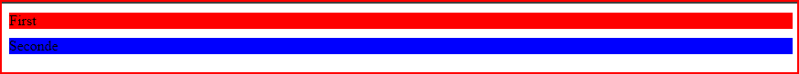
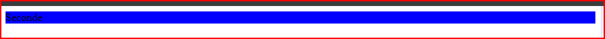
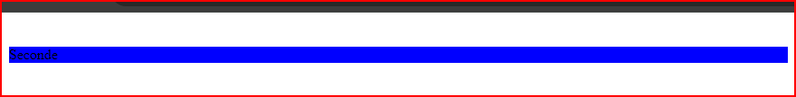

# cour 15 : **Visibilité**


>L'objectif de ce cours est de manipuler la visibilité des éléments en CSS, une propriété très utile . Par exemple dans le contexte des quiz, lorsqu'on appuie sur le bouton de réponse, le contenu peut s'afficher ou dans le cas des animations. Nous explorerons deux approches essentielles, à savoir l'utilisation des propriétés `display` et `visibility`.

## 1. **``display: none``**

- **Description:**
    
    La valeur `display: none;` en CSS est utilisée pour rendre un élément complètement invisible sur la page. Lorsque cette valeur est appliquée à un élément, il est retiré du flux normal du document, et aucun espace n'est réservé pour cet élément. En d'autres termes, l'élément est caché et ne prend pas de place dans la mise en page de la page web.
 
- **Utilisation:**
    
    - L'utilisation de `display: none;` est courante lorsque vous souhaitez masquer temporairement ou initialement un élément, par exemple, pour afficher ou masquer dynamiquement des sections d'une page en réponse à des actions de l'utilisateur, comme le clic sur un bouton. Cela peut également être utilisé dans le cadre de techniques de développement Web pour optimiser l'accessibilité ou améliorer la performance en chargeant des éléments de manière conditionnelle.

- **Voici un exemple d'utilisation de `display: none;` dans une règle CSS :**

    ```css
    .element-a-masquer {
        display: none;
    }
    ```

    Dans ce cas, tous les éléments de classe "element-a-masquer" seront invisibles sur la page tant que cette règle est appliquée. Pour rendre l'élément visible à nouveau, vous devrez modifier la valeur de la propriété `display` à quelque chose d'autre, par exemple, `display: block;`, `display: inline;`, ou toute autre valeur appropriée selon le contexte.


## 2. **La propriété CSS ``visibility``:**

- **Description:**
    
    La propriété CSS `visibility` est utilisée pour contrôler la visibilité d'un élément sur une page web. Contrairement à la propriété `display`, qui affecte la visibilité et la disposition d'un élément, `visibility` se concentre uniquement sur la visibilité tout en préservant l'espace occupé par l'élément dans la mise en page.


- **Les principales valeurs que peut prendre la propriété `visibility` sont :**

    1. `visible`: L'élément est visible.

        ```css
        .visible-element {
            visibility: visible;
        }
        ```

    2. `hidden`: L'élément est invisible, mais il occupe toujours l'espace sur la page.

        ```css
        .hidden-element {
            visibility: hidden;
        }
        ```


- **Exemple d'utilisation de `visibility` avec HTML :**

    ```html
    <!DOCTYPE html>
    <html lang="en">
        <head>
            <meta charset="UTF-8">
            <meta name="viewport" content="width=device-width, initial-scale=1.0">
            <style>
                .hidden-element {
                visibility: hidden;
                }
            </style>
        <title>Visibility Example</title>
        </head>
        <body>
            <p>Ceci est un paragraphe visible.</p>
            <p class="hidden-element">Ceci est un paragraphe invisible mais occupe toujours de l'espace.</p>
        </body>
    </html>

    ```

    Dans cet exemple, le deuxième paragraphe est caché, mais l'espace qu'il occupe est maintenu dans la mise en page.


### RQ : **La différence entre `display: none;` et `visibility: hidden;`**

La différence fondamentale entre `display: none;` et `visibility: hidden;` est que, dans le cas de `visibility: hidden;`, l'élément reste dans le flux du document, conservant son espace, mais il devient simplement invisible. Cela peut être utile lorsque vous souhaitez cacher un élément tout en maintenant l'espace qu'il occupe dans la mise en page.

- **sans masquer:**

    

- **`display: none;`**

    

- **`visibility: hidden;`**
    
    