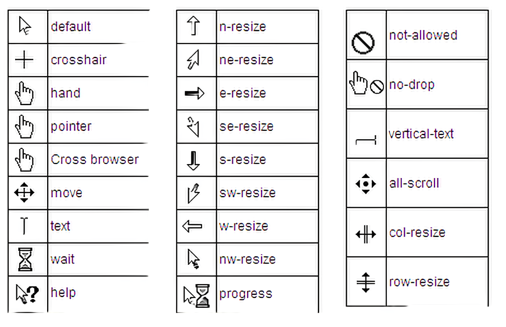

# cour 18 : **``cursor``**

- **Description:**

    >La propriété CSS `cursor` est utilisée pour spécifier le type de curseur qui doit être affiché lorsque le pointeur de la souris survole un élément. Elle permet de personnaliser l'apparence du curseur en fonction du contexte, offrant une indication visuelle à l'utilisateur sur la nature de l'interaction possible avec l'élément.


- **Voici quelques valeurs couramment utilisées avec la propriété `cursor` :**

    - `auto`: Le navigateur détermine le type de curseur approprié en fonction du contexte.
    - `default`: Le curseur par défaut, généralement une flèche.
    - `pointer`: Indique que l'élément est cliquable (comme un lien).
    - `text`: Indique que du texte peut être sélectionné.
    - `move`: Indique que l'élément peut être déplacé.
    - `not-allowed`: Indique que l'action associée à l'élément n'est pas autorisée.

- **Exemple d'utilisation de la propriété `cursor` :**

    ```css
    .button {
        cursor: pointer;
    }

    .text-input {
        cursor: text;
    }

    .draggable {
        cursor: move;
    }

    .disabled {
        cursor: not-allowed;
    }
    ```

    Dans cet exemple, l'élément avec la classe `.button` affichera un curseur de type main-pointer lorsqu'il sera survolé, indiquant qu'il est cliquable. L'élément avec la classe `.text-input` montrera un curseur de type texte, signalant que le texte peut être sélectionné. L'élément avec la classe `.draggable` aura un curseur de type "move", indiquant qu'il peut être déplacé. Enfin, l'élément avec la classe `.disabled` affichera un curseur "not-allowed", signalant que l'action associée à cet élément n'est pas autorisée.


