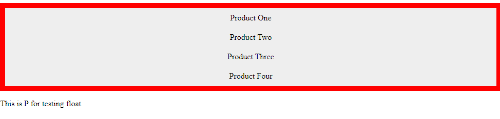
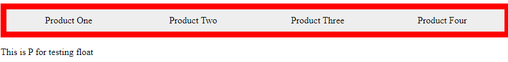

# cour 19 : **``Les boîtes flottantes``**


>L'objectif de ce cours est d'introduire la propriété **``float``** qui permet de positionner les éléments dans un conteneur.

## 1.**Le ``flux normal``:**


- Le ``flux normal`` dans le contexte du modèle de boîte en CSS se réfère à la disposition standard des éléments dans le document. 

- Dans le flux normal, chaque élément est affiché l'un en dessous de l'autre, de manière verticale, à partir du haut de la page ou du conteneur parent. Chaque élément occupe toute la largeur de son conteneur parent et pousse les éléments suivants vers le bas.

- Lorsqu'un élément est retiré du flux normal à l'aide de la propriété `float`, il est positionné à gauche ou à droite de son conteneur, et les éléments suivants peuvent entourer cet élément flottant plutôt que d'être poussés en dessous.Cela peut être utile pour créer des mises en page plus complexes, telles que des mises en page à plusieurs colonnes. 


## 2. **Défintion:``float``**

- **Description:**

    >La propriété CSS ``float`` indique qu'un élément doit être retiré du flux normal et doit être placé sur le côté droit ou sur le côté gauche de son conteneur.cette propriéte est utilise


- **La propriété `float` peut prendre deux valeurs principales :**

    1. `float: left;`  L'élément est retiré du flux normal et est aligné sur le côté gauche de son conteneur ou du contenu qui le précède.

    2. `float: right;`  L'élément est retiré du flux normal et est aligné sur le côté droit de son conteneur ou du contenu qui le précède.


- **Voici un exemple simple d'utilisation de la propriété `float` en CSS :**

    ```css
    .float-left {
        float: left;
        width: 50%; /* pour 2 éléments */
    }

    .float-right {
        float: right;
        width: 25%; /* pour 4 éléments */
    }
    ```

    Dans cet exemple, les éléments avec les classes `.float-left` et `.float-right` seront positionnés côte à côte avec une largeur de 50% , 25%, créant une mise en page à deux colonnes.


### RQ :

- Il est important de noter que l'utilisation excessive de la propriété `float` peut parfois entraîner des problèmes de mise en page et de clarté du code. En raison de cela, de nouvelles approches telles que l'utilisation de ``flexbox`` ou de ``CSS Grid`` sont souvent recommandées pour la création de mises en page plus modernes et flexibles.


## 3. **Problème posé par le float :**


### 3.1 **Déplacement de l'élément suivant :**

- **Description :** 
    >Lorsqu'un élément est flottant, il est retiré du flux normal, ce qui peut entraîner le chevauchement ou le déplacement des éléments suivants. Cela peut perturber la mise en page attendue.
   

- **Exemple :**
    
    - **fichier.html:**

     ```html
        <div class="parent">
            <div class="div1">Product One</div>
            <div class="div2">Product Two</div>
            <div class="div3">Product Three</div>
            <div class="div4">Product Four</div>
        </div>

        <p>This is P for testing float</p>
     ```
    - **fichier.css**
     ```css
    .parent {
        background-color: red;
        padding: 10px;
        /* overflow: hidden; */

    }


    .parent div {
        padding-top: 10px;
        padding-bottom: 10px;
        text-align: center;
        background-color: #EEE;
        width: 15%;
        float: left;
    }

     ```

    - **Avant le float:**

     
     
    - **Aprés le float:**

        


### 3.2 **Dégradation de la hauteur du parent (overflow: hidden) :**

- **Description :** 
    
    >Lorsque des éléments enfants flottants dépassent la hauteur du conteneur parent, le conteneur parent ne peut  pas prendre correctement en compte la hauteur des éléments flottants, entraînant une dégradation de la hauteur.


    


- **Solution :** On peut utiliser la propriété CSS `overflow` avec la valeur `hidden` sur le conteneur parent pour forcer celui-ci à considérer la hauteur des éléments flottants.
     ```css
     .parent {
       overflow: hidden;
     }
     ```


## 4. **La propriété  `clear`:**

- **Description:**
    
    >La propriété CSS `clear` est utilisée pour spécifier de quel côté un élément ne doit pas être influencé par les éléments flottants. Elle est souvent utilisée pour résoudre les problèmes de déplacement d'éléments suivants causés par des éléments flottants.
  

- **La propriété `clear` peut prendre l'une des valeurs suivantes :**

    - `none` : Aucun côté n'est affecté, c'est-à-dire que l'élément peut être adjacent à des éléments flottants à la fois du côté gauche et du côté droit.
    - `left` : L'élément ne doit pas être influencé par des éléments flottants situés à gauche. Ainsi, il sera déplacé en dessous de tout élément flottant à gauche.
    - `right` : L'élément ne doit pas être influencé par des éléments flottants situés à droite. Il sera déplacé en dessous de tout élément flottant à droite.
    - `both` : L'élément ne doit pas être influencé par des éléments flottants situés à la fois à gauche et à droite. Il sera déplacé en dessous de tous les éléments flottants.

- **Exemple d'utilisation de la propriété `clear` :**

    ```css
    .clear-example {
        clear: both;
    }
    ```

    Dans cet exemple, l'élément avec la classe `.clear-example` ne sera pas influencé par des éléments flottants situés à la fois à gauche et à droite, et il sera déplacé en dessous de tous les éléments flottants.

## 5. **Solution de Pb de ``float``:**

### 5.1 **Methode ``clear``:**

>Pour résoudre les problèmes déjà mentionnés dus à l'utilisation de `float`, on peut utiliser `clear`. Il suffit d'ajouter un autre élément dans le conteneur des éléments flottants, de lui donner une classe appelée 'clear', par exemple, et d'appliquer le style suivant en CSS :

```css
.clear {
    clear: both;
}
```

- **Exemple :**

    - **fichier.html**

        ```html
            <div class="parent">
                <div class="div1">Product One</div>
                <div class="div2">Product Two</div>
                <div class="div3">Product Three</div>
                <div class="div4">Product Four</div>
                <p class="clear"></p>
            </div>

            <p>This is P for testing float</p>

        ```
    - **fichier.css**
        ```css
        .parent {
            background-color: red;
            padding: 10px;


        }


        .parent div {
            padding-top: 10px;
            padding-bottom: 10px;
            text-align: center;
            background-color: #EEE;
            width: 25%;
            float: left;
        }


        .clear {
            clear: both;
        }

        ```
    - **Résultat:**

        


### 5.2 **Methode ``overflow: hidden``:**


>On peut aussi utiliser la méthode `overflow: hidden` pour résoudre les problèmes de `float` en accédant au parent, c'est-à-dire le conteneur des éléments flottants.


- **Exemple :**

    - **fichier.html**

        ```html
            <div class="parent">
                <div class="div1">Product One</div>
                <div class="div2">Product Two</div>
                <div class="div3">Product Three</div>
                <div class="div4">Product Four</div>
            </div>

            <p>This is P for testing float</p>

        ```
    - **fichier.css**
        ```css
        .parent {
            background-color: red;
            padding: 10px;
            overflow: hidden;


        }


        .parent div {
            padding-top: 10px;
            padding-bottom: 10px;
            text-align: center;
            background-color: #EEE;
            width: 25%;
            float: left;
        }
        ```
    - **Résultat:**

        