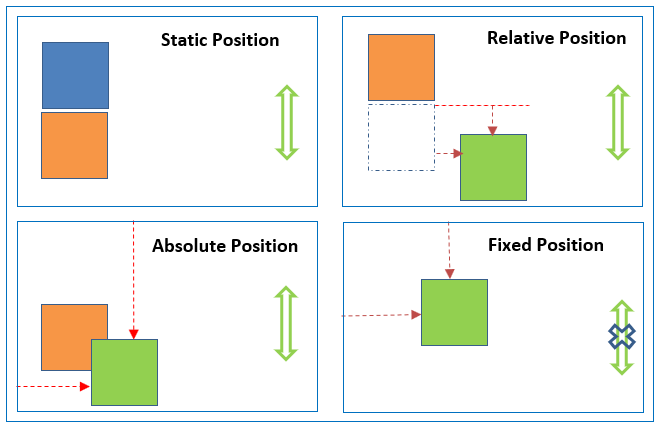
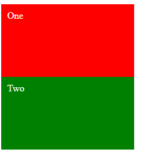
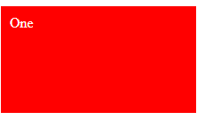

# cour 21 : **``position:``**


>La propriété `position` avec `left`, `top`, `bottom` et `right` permet de déplacer un élément d'une position vers une autre. Dans ce cours, nous allons explorer les différentes façons de déplacer les éléments avec ces propriétés en CSS.


## 1. **la propriéte ``position``:**

- **Description:**

    >La propriété CSS ``position`` définit la façon dont un élément est positionné dans un document ie :  définir le type de positionnement d'un élément dans une mise en page. Les propriétés ``top``, ``right``, ``bottom`` et ``left`` déterminent l'emplacement final de l'élément positionné
    
- **Valeurs:**

1. **``static:``** C'est la valeur par défaut. Un élément positionné en statique est simplement affiché dans l'ordre normal du flux HTML. Les propriétés top, right, bottom, left n'ont aucun effet sur un élément avec `position: static`.

    ```css
    .exemple {
        position: static;
    }
    ```

2. **``relative:``** L'élément est positionné par rapport à sa position normale dans le flux du document. Cela signifie que vous pouvez utiliser les propriétés top, right, bottom et left pour le déplacer par rapport à sa position normale.

   ```css
   .exemple {
     position: relative;
     top: 10px;
     left: 20px;
   }
   ```

3. **``absolute:``** L'élément est positionné par rapport au **``premier parent positionné``** (autre que static), ou par rapport à l'élément contenant s'il n'y a pas de parent positionné. Les propriétés top, right, bottom et left sont utilisées pour le déplacer.

   ```css
   .exemple {
     position: absolute;
     top: 50px;
     left: 100px;
   }
   ```

4. **``fixed:``** L'élément est positionné par rapport à la fenêtre du navigateur, et restera fixe même si la page est scrollée. Les propriétés top, right, bottom et left sont utilisées pour le positionner.

   ```css
   .exemple {
     position: fixed;
     top: 0;
     left: 0;
   }
   ```

5. **``sticky :``** L'élément est positionné en fonction du bloc de défilement contenant le bloc parent. Il fonctionne comme relative jusqu'à ce que l'élément atteigne un certain point pendant le défilement, puis il devient fixe.

   ```css
   .exemple {
     position: sticky;
     top: 20px;
   }
   ```




## 2. **les propriétés `top`, `left`, `right` et `bottom`:**


- **Description:**

    >les propriétés `top`, `left`, `right` et `bottom` sont utilisées pour définir la position d'un élément par rapport à son conteneur positionné. Ces propriétés sont généralement associées à la propriété `position`.

    >Ces propriétés sont souvent utilisées en conjonction avec `position: relative` pour déplacer un élément par rapport à sa position normale dans le flux du document. Elles sont également utilisées avec `position: absolute` pour positionner un élément par rapport à son conteneur positionné, ou avec `position: fixed` pour le positionner par rapport à la fenêtre du navigateur.
    

- **Voici une brève explication de chacune de ces propriétés :**

1. **`top` :** Définit la distance entre le bord supérieur de l'élément et le bord supérieur de son conteneur positionné.

   ```css
   .exemple {
     position: relative;
     top: 20px;
   }
   ```

   Dans cet exemple, l'élément sera déplacé vers le bas de 20 pixels par rapport à sa position normale.

2. **`left` :** Définit la distance entre le bord gauche de l'élément et le bord gauche de son conteneur positionné.

   ```css
   .exemple {
     position: relative;
     left: 30px;
   }
   ```

   L'élément sera déplacé vers la droite de 30 pixels par rapport à sa position normale.

3. **`right` :** Définit la distance entre le bord droit de l'élément et le bord droit de son conteneur positionné.

   ```css
   .exemple {
     position: relative;
     right: 40px;
   }
   ```

   Dans cet exemple, l'élément sera déplacé vers la gauche de 40 pixels par rapport à sa position normale.

4. **`bottom` :** Définit la distance entre le bord inférieur de l'élément et le bord inférieur de son conteneur positionné.

   ```css
   .exemple {
     position: relative;
     bottom: 50px;
   }
   ```

   L'élément sera déplacé vers le haut de 50 pixels par rapport à sa position normale.


### RQ : **chevauchement `position: absolute`**

- **Description :**

  - Lorsque vous spécifiez `position: absolute` pour un élément (par exemple, `div1`), cet élément est retiré du flux normal du document et positionné par rapport à son premier ancêtre positionné, ou par rapport à l'élément contenant s'il n'y a pas d'ancêtre positionné.

  - Si vous avez deux divs, par exemple, `div1` et `div2`, et que `div1` a `position: absolute`, cela signifie que `div1` sera positionné par rapport à son premier ancêtre positionné. Si aucun ancêtre n'a une position différente de `static` (qui est la valeur par défaut), alors `div1` sera positionné par rapport au document lui-même.

  - Par conséquent, si `div2` est l'élément suivant immédiat dans le flux du document après `div1`, et `div1` a `position: absolute`, `div2` pourrait se chevaucher avec `div1`. Cela se produit parce que `div1` est retiré du flux normal et ne prend pas d'espace dans le flux, laissant l'emplacement où il aurait dû être vacant.

  - Si vous voulez éviter le chevauchement, vous pouvez ajuster la position de `div2` en utilisant des propriétés telles que `margin-top`, `margin-left`, ou en spécifiant également une `position` différente pour `div2` (comme `relative` ou `absolute` avec des valeurs pour `top`, `left`, etc.).


- **Voici un exemple pour illustrer cela :**

  - **fichier.html:**
    ```html
    <div class="one">One</div>
    <div class="two">Two</div>
    ```
  - **fichier.css**

    ```css
    .one {

        background-color: red;
        color: white;
        padding: 10px;
        width: 200px;
        height: 100px;
        position: absolute;


    }

    .two {
        background-color: green;
        color: white;
        padding: 10px;
        width: 200px;
        height: 100px;

    }


    ```

  - **Affichage:**

    - **sans position:absolute**
        
      
    
    - **avec position:absolute**

      