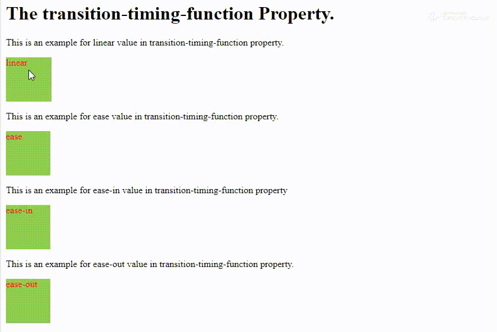

# cour 28 : **``Transition:``**


## 1. **Introduction:**


>Les transitions CSS permettent de contrôler la vitesse d'animation lorsque les propriétés CSS sont modifiées. Plutôt que le changement soit immédiat, on peut l'étaler sur une certaine période. 

- La propriété ``transition`` en CSS permet de spécifier comment les changements de style doivent être animés lorsqu'ils surviennent. Elle permet de créer des effets de transition fluides entre deux états d'un élément. Cette propriété est utile pour améliorer l'expérience utilisateur en rendant les changements visuels plus agréables et moins brusque

- **Les transitions CSS vous permettent de choisir :**

    - les propriétés à animer en les listant explicitement
    - le début de l'animation
    - la durée de l'animation
    - la façon dont la transition s'exécutera


## 2. **les propriétes ``transition_*``:**

### 2.1 **``transition-duration:``**

- **Description:**

    >La propriété `transition-duration` en CSS est utilisée pour spécifier la durée d'une transition animée définie avec la propriété `transition`. Cette propriété indique le temps que prendra l'animation pour passer d'un état à un autre. 
    
    
- **La syntaxe est la suivante :**

    ```css
    transition-duration: time;
    ```

    - `time` : La durée de la transition, spécifiée en secondes (`s`) ou en millisecondes (`ms`).

- **Exemple d'utilisation :**

    ```css
    .box {
    width: 100px;
    height: 100px;
    background-color: #3498db;
    transition-duration: 0.5s; /* La transition de la largeur prendra 0.5 seconde */
    }

    .box:hover {
    width: 150px;
    }
    ```

    Dans cet exemple, la boîte (élément avec la classe `.box`) aura une transition de la largeur lorsque la largeur change. La propriété `transition-duration` spécifie que cette transition doit durer 0.5 seconde.

### 2.2 **``transition-delay:``**

- **Description:**

    >La propriété `transition-delay` en CSS est utilisée pour spécifier le délai avant le début d'une transition animée définie avec la propriété `transition`. Elle permet de retarder le démarrage de l'animation après que le changement d'état a eu lieu. 
    
    
- **La syntaxe est la suivante :**

    ```css
    transition-delay: time;
    ```

    - `time` : Le délai avant le début de la transition, spécifié en secondes (`s`) ou en millisecondes (`ms`).

- **Exemple d'utilisation :**

    ```css
    .box {
        width: 100px;
        height: 100px;
        background-color: #3498db;
        transition-duration: 0.5s;
        transition-delay: 0.2s; /* La transition de la largeur commencera 0.2 seconde après le changement */
    }

    .box:hover {
        width: 150px;
    }
    ```

    La propriété `transition-delay` spécifie que la transition de la largeur commencera 0.2 seconde après le déclenchement de l'événement de survol (`:hover`).


### 2.3 **``transition-property:``**

- **Description:**

    >La propriété `transition-property` en CSS est utilisée pour spécifier les propriétés CSS auxquelles une transition doit s'appliquer. Elle permet de définir explicitement quelles propriétés doivent être animées lorsqu'un changement d'état survient. 
    
- **La syntaxe est la suivante :**

    ```css
    transition-property: value;
    ```

    - `value` : La valeur de la propriété peut être spécifiée de plusieurs manières :
        - `'all'` : Toutes les propriétés doivent être animées.
        - Une propriété spécifique, telle que `width`, `color`, `opacity`, etc.
        - Une liste de propriétés séparées par des virgules, par exemple, `width, color, opacity`.

- **Exemple 1 d'utilisation :**

    ```css
    .box {
        width: 100px;
        height: 100px;
        background-color: #3498db;
        transition-property: width; /* Seule la propriété 'width' sera animée lors d'un changement */
        transition-duration: 0.5s;
    }

    .box:hover {
        width: 150px;
        margin-left : 20px;
    }
    ```

    La propriété `transition-property` spécifie explicitement que seule la propriété `width` doit être animée lors de cette transition.


### 2.4 **``transition-timing-function:``**

- **Description:**

    >La propriété `transition-timing-function` en CSS est utilisée pour spécifier la courbe de vitesse ou la fonction de temporisation qui contrôle la manière dont une transition animée progresse dans le temps. Elle permet de définir l'accélération ou le ralentissement de l'animation. 


- **La syntaxe est la suivante :**

    ```css
    transition-timing-function: value;
    ```

    - `value` : La valeur de la propriété peut être spécifiée de plusieurs manières :
        - Des mots-clés prédéfinis tels que `ease`, `linear`, `ease-in`, `ease-out`, et `ease-in-out`.
        - Une fonction de temporisation personnalisée définie à l'aide de la fonction `cubic-bezier()`.

- **les valeurs:**

    1. **`ease` :** Cette valeur crée une courbe de vitesse qui commence lentement, accélère au milieu de la transition, puis ralentit à la fin. C'est une courbe de vitesse douce et couramment utilisée, offrant une transition agréable.

    2. **`linear` :** Une transition linéaire, ce qui signifie que la vitesse de l'animation est constante tout au long de la transition. Il n'y a pas d'accélération ou de décélération.

    3. **`ease-in` :** La transition commence lentement et accélère à mesure qu'elle progresse. Il y a une accélération au début de l'animation.

    4. **`ease-out` :** La transition commence rapidement et ralentit à mesure qu'elle progresse. Il y a une décélération à la fin de l'animation.

    5. **`ease-in-out` :** C'est une combinaison de `ease-in` et `ease-out`. La transition commence lentement, accélère au milieu, puis ralentit à la fin. C'est une option couramment utilisée pour des transitions en douceur.

    


- **Exemple d'utilisation  :**

    ```css
    .box {
        width: 100px;
        height: 100px;
        background-color: #3498db;
        transition-property: width;
        transition-duration: 0.5s;
        transition-timing-function: ease-in-out; /* La courbe de vitesse est 'ease-in-out' */
    }

    .box:hover {
        width: 150px;
    }
    ```

    Dans cet exemple, la boîte (élément avec la classe `.box`) aura une transition de la largeur (`width`) lorsqu'elle est survolée. La propriété `transition-timing-function` spécifie que la courbe de vitesse de la transition sera une fonction préétablie de type `ease-in-out`, ce qui signifie qu'elle commencera lentement, accélérera au milieu, puis ralentira à la fin.


## 3. **Le raccourci `transition`:**

- **Description:**

    >Le raccourci `transition` en CSS permet de définir simultanément les propriétés `transition-property`, `transition-duration`, `transition-timing-function` et `transition-delay` pour une ou plusieurs transitions. Cela simplifie le code en regroupant ces différentes propriétés en une seule ligne. 
    
    
- **La syntaxe générale du raccourci `transition` est la suivante :**

    ```css
    transition: property duration timing-function delay;
    ```

    - `property` : La propriété CSS que vous souhaitez animer.
    - `duration` : La durée de la transition.
    - `timing-function` : La fonction de temporisation ou la courbe de vitesse de la transition.
    - `delay` : Le délai avant le début de la transition.

- **Voici un exemple d'utilisation du raccourci `transition` :**

    ```css
    .box {
        width: 100px;
        height: 100px;
        background-color: #3498db;
        transition: width 0.5s ease-in-out 0.2s;
    }

    .box:hover {
        width: 150px;
    }
    ```

    Dans cet exemple, la boîte (élément avec la classe `.box`) aura une transition de la largeur (`width`) lorsqu'elle est survolée. Le raccourci `transition` est utilisé pour définir la propriété à animer (`width`), la durée de la transition (`0.5s`), la fonction de temporisation (`ease-in-out`), et le délai avant le début de la transition (`0.2s`).


- Vous pouvez également spécifier plusieurs transitions en séparant chaque définition de transition par une virgule. Par exemple :


    ```css
    .box {
        width: 100px;
        height: 100px;
        background-color: #3498db;
        transition: width 0.5s ease-in-out 0.2s, 
                    color 0.3s linear;
    }

    .box:hover {
        width: 150px;
        color: #e74c3c;
    }
    ```

    Dans cet exemple, deux transitions sont définies : une pour la largeur (`width`) et une pour la couleur (`color`). Chaque définition de transition est séparée par une virgule dans la propriété `transition`.


