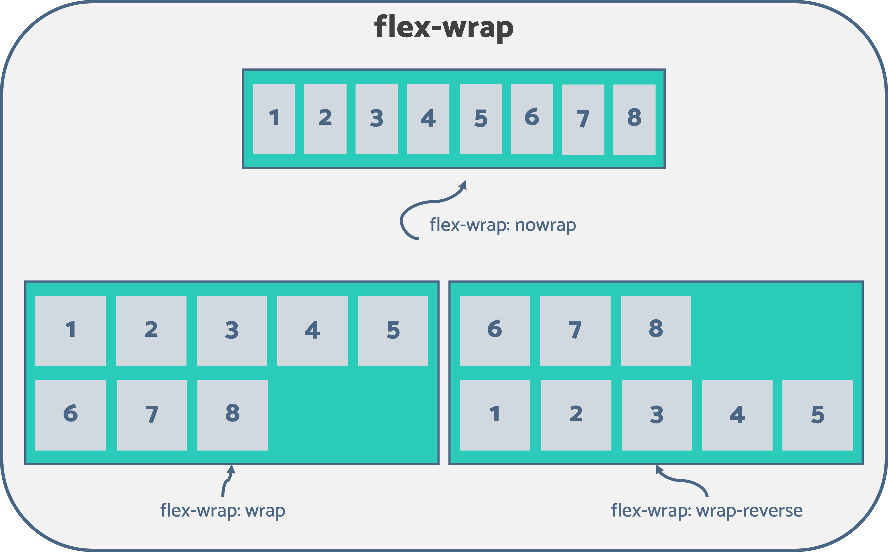

# cour 30 : **``flex-box``**

## 1. **Introduction:**

- **Definition:**

    >Le modèle de mise en page Flexbox, abréviation de Flexible Box, est une technique de conception en CSS qui offre une approche plus efficace et prédictive pour organiser les éléments d'une page, en particulier lorsqu'il s'agit de créer des mises en page complexes et responsives. Introduit dans CSS3, le Flexbox permet de créer des designs flexibles et adaptables, offrant une alternative puissante aux modèles de mise en page traditionnels basés sur la boîte (block) et l'inline.

    - Le principal avantage du Flexbox réside dans sa capacité à distribuer l'espace disponible de manière dynamique entre les éléments d'un conteneur, quelle que soit leur taille initiale, tout en préservant une mise en page cohérente. Il simplifie également la gestion de l'alignement, de la distribution et de l'ordre des éléments, offrant ainsi une solution plus intuitive pour la création de mises en page complexes.

    - Le Flexbox fonctionne sur un modèle bidimensionnel, permettant de disposer les éléments le long d'un axe principal (``main axis``) et d'un axe transversal (``cross axis``), offrant ainsi une grande flexibilité pour créer des designs aussi bien horizontaux que verticaux. 
    

    


- **parent flexible:`display: flex`**

    - **Description:**
        
        >Pour utiliser le modèle de Flexbox, vous devez appliquer la propriété `display: flex` à l'élément parent, également appelé ``conteneur`` flex ou flex container. Cela active le mode flex pour le conteneur et définit les enfants directs de cet élément comme des éléments flexibles, ou flex items.


    - **Syntaxe:** 

        ```css
        .container {
            display: flex;
        }
        ```

        - Anisi tous les enfants directs de l'élément avec la classe ``container`` seront traités comme des éléments flexibles selon les règles de Flexbox. Vous pouvez ensuite utiliser d'autres propriétés Flexbox telles que `flex-direction`, `justify-content`, `align-items`, etc., pour définir le comportement et la disposition des éléments à l'intérieur du conteneur flexible.


- **Exemple:**

    - **fichier.html:**

        ```html
        <div class="flex">
            <div>One</div>
            <div>Two</div>
            <div>Three</div>
            <div>Four</div>
        </div>
        ```

    - **fichier.css:**

        ```css
        .flex {
            display: flex; # pour rendre le parent flexible
            background-color: #eee;
            width: 600px;
            padding: 20px;
            margin: 20px auto;
        }

        .flex div {
            background-color: #f00;
            color: white;
            width: 25%; # partager le width entre les items
            text-align: center;
            padding: 20px;
        }

        ```

    - **Affichage:**

        


## 2. **``flex-direction`` , ``flex-wrap`` et ``flex-flow``:**


### 2.1 **``flex-direction``:**


- **Description:**

    >La propriété `flex-direction` en CSS est utilisée pour définir la direction principale (l'axe principal) selon lequel les éléments flexibles à l'intérieur d'un conteneur flex sont disposés , cette propriété est écrite dans le parent .
    
    - `flex-direction` détermine l'orientation des éléments flexibles dans le conteneur.


- **Valeurs Possibles:**

    - **`row` (par défaut) :** Les éléments sont disposés dans la même direction que le texte, de gauche à droite pour les langues occidentales.

        ```css
        .container {
            flex-direction: row;
        }
        ```

    - **`row-reverse` :** Les éléments sont disposés de droite à gauche (selon la direction  de la page ).

        ```css
        .container {
            flex-direction: row-reverse;
        }
        ```

    - **`column` :** Les éléments sont disposés de haut en bas.

        ```css
        .container {
            flex-direction: column;
        }
        ```

    - **`column-reverse` :** Les éléments sont disposés de bas en haut.

        ```css
        .container {
            flex-direction: column-reverse;
        }
        ```


- **Exemple:**


    ```css
    .container {
        display: flex;
        flex-direction: column;
    }
    ```

    Dans cet exemple, les éléments à l'intérieur du conteneur flexible seront disposés de haut en bas, créant ainsi une disposition en colonne. 


### 2.2 **``flex-wrap``:**


- **Description:**

    >La propriété `flex-wrap` en CSS est utilisée pour spécifier si les éléments flexibles à l'intérieur d'un conteneur flex doivent être disposés sur une seule ligne ou s'ils peuvent être enroulés sur plusieurs lignes ou colonnes si nécessaire.(cette propriété est écrite dans le parent)

    - `flex-wrap` contrôle le comportement de mise en ligne des éléments flexibles lorsque la taille de l'espace disponible est insuffisante pour tous les contenir sur une seule ligne ou colonne.


- **Valeurs:**

    - **`nowrap` (par défaut) :** Les éléments flexibles sont disposés sur une seule ligne ou colonne, et sont réduits en taille si nécessaire pour tenir dans l'espace disponible.

        ```css
        .container {
            flex-wrap: nowrap;
        }
        ```

    - **`wrap` :** Les éléments flexibles peuvent être disposés sur plusieurs lignes ou colonnes si nécessaire.

        ```css
        .container {
            flex-wrap: wrap;
        }
        ```

    - **`wrap-reverse` :** Les éléments flexibles sont disposés sur plusieurs lignes ou colonnes dans l'ordre inverse,  de bas en haut .

        ```css
        .container {
            flex-wrap: wrap-reverse;
        }
        ```


    


- **Exemple:**

    ```css
    .container {
        display: flex;
        flex-wrap: wrap;
    }
    ```

    Dans cet exemple, les éléments flexibles peuvent être disposés sur plusieurs lignes ou colonnes si nécessaire, en fonction de la taille de l'espace disponible dans le conteneur flexible. Cette disposition flexible est utile pour créer des mises en page responsives qui s'adaptent à différentes tailles d'écrans et de fenêtres de navigateur.


### 2.3 **``flex-flow``:**

- **Description:**

    >La propriété raccourcie `flex-flow` en CSS permet de définir à la fois la direction principale (axe principal) et le comportement de l'enroulement (wrap) des éléments flexibles à l'intérieur d'un conteneur flex. Cette propriété combine les propriétés `flex-direction` et `flex-wrap`.


- **Syntaxe:**

    ```css
    flex-flow: <flex-direction> <flex-wrap>;
    ```

    - `<flex-direction>` : La direction principale (``row``, ``row-reverse``, ``column``, ``column-reverse``).
    - `<flex-wrap>` : Le comportement de l'enroulement (``nowrap``, ``wrap``, ``wrap-reverse``).


- **Exemple:**

    ```css
    .container {
        flex-flow: row wrap;
    }
    ```

    Cette déclaration équivaut à `flex-direction: row;` et `flex-wrap: wrap;`. Les éléments flexibles seront disposés en ligne avec la possibilité de s'enrouler sur plusieurs lignes si nécessaire.

## 3. **``justify-content:``**


- **Description:**

    >La propriété CSS `justify-content` est utilisée dans les modèles de mise en page flexbox pour définir la manière dont l'espace disponible est distribué le long de l'axe principal des éléments flexibles dans un conteneur. Cette propriété permet de justifier (aligner) les éléments le long de cet axe. Elle ne s'applique qu'aux conteneurs flexibles.

    - `justify-content` contrôle la distribution des éléments flexibles le long de l'axe principal du conteneur flexible.


- **Valeurs:**

    - **`flex-start` (par défaut) :** Les éléments sont alignés au début de l'axe principal.

        ```css
        .container {
            justify-content: flex-start;
        }
        ```

    - **`flex-end` :** Les éléments sont alignés à la fin de l'axe principal.

        ```css
        .container {
            justify-content: flex-end;
        }
        ```

    - **`center` :** Les éléments sont centrés le long de l'axe principal.

        ```css
        .container {
            justify-content: center;
        }
        ```

    - **`space-between` :** Les éléments ont espacés équitablement selon l'axe principal. L'espace utilisé entre chaque élément est le même,Le premier élément est aligné sur le bord du conteneur et le dernier élément est aussi aligné sur le bord de l'élément

        ```css
        .container {
            justify-content: space-between;
        }
        ```

    - **`space-around` :** Les éléments ont espacés équitablement selon l'axe principal. L'espace utilisé entre chaque élément est le même. L'espace entre le bord du conteneur et le premier élément et l'espace entre le dernier élément et le bord du conteneur représente la moitié de l'espace entre deux éléments.

        ```css
        .container {
            justify-content: space-around;
        }
        ```

    - **`space-evenly` :** Les éléments sont espacés équitablement. L'espace utilisé entre chaque élément, entre le bord du conteneur et le premier élément, et entre le dernier élément et le bord du conteneur est le même

        ```css
        .container {
            justify-content: space-evenly;
        }
        ```


                   


- **Exemples:**

    ```css
    .container {
        display: flex;
        justify-content: center;
    }
    ```

    Dans cet exemple, les éléments à l'intérieur du conteneur flexible seront centrés le long de l'axe principal du conteneur. 

## 4. **``align-items:``**

- **Description:**

    >La propriété CSS `align-items` est utilisée dans les modèles de mise en page flexbox pour définir la manière dont les éléments flexibles sont alignés le long de l'axe transversal (l'axe perpendiculaire à l'axe principal) à l'intérieur d'un conteneur flexible. Cette propriété s'applique au conteneur flexible.

    - `align-items` contrôle l'alignement des éléments flexibles le long de l'axe transversal du conteneur flexible.


- **Valeurs:**

    - **`stretch` (par défaut) :** Les éléments sont étirés pour remplir la hauteur du conteneur (à moins qu'ils n'aient une hauteur fixe).

        ```css
        .container {
            align-items: stretch;
        }
        ```

    - **`flex-start` :** Les éléments sont alignés au début de l'axe transversal.

        ```css
        .container {
            align-items: flex-start;
        }
        ```

    - **`flex-end` :** Les éléments sont alignés à la fin de l'axe transversal.

        ```css
        .container {
            align-items: flex-end;
        }
        ```

    - **`center` :** Les éléments sont centrés le long de l'axe transversal.

        ```css
        .container {
            align-items: center;
        }
        ```

    - **`baseline` :** Les éléments sont alignés basé sur leur ligne de base (la ligne imaginaire où le texte repose).

        ```css
        .container {
            align-items: baseline;
        }

        ```


    


- **Exemple:**

    - **fichier.html:**

        ```html
        <div class="flex">
            <div class="one">One</div>
            <div class="two">Two</div>
            <div class="three">Three</div>
        </div>        
        ```

    - **fichier.css:**


        ```css
        .flex {
            display: flex;
            background-color: #eee;
            width: 600px;
            padding: 20px;
            margin: 20px auto;
            align-items: ?;
        }

        .flex .two {
            height: 120px;
        }

        ```
    
    - **Affichage:**

        - **``align-items: stretch;``**

            
        
        - **``align-items: flex-start;``**

            

        
        - **``align-items: flex-end;``**

            
        
        - **``align-items: center;``**

            


## 5. **``align-content``:**


- **Description:**

    >La propriété CSS `align-content` est utilisée dans les modèles de mise en page flexbox pour définir la manière dont l'espace supplémentaire est distribué le long de l'axe transversal des éléments flexibles dans un conteneur flex qui a plusieurs lignes. Cette propriété s'applique lorsque les éléments flexibles sont alignés sur plusieurs lignes en raison du comportement d'enroulement (wrap).

    - `align-content` contrôle la distribution de l'espace supplémentaire sur l'axe transversal du conteneur flexible lorsque celui-ci a plusieurs lignes.


- **Valeurs:**

    - **`flex-start` :** Les lignes sont alignées au début de l'axe transversal.

        ```css
        .container {
            align-content: flex-start;
        }
        ```

    - **`flex-end` :** Les lignes sont alignées à la fin de l'axe transversal.

        ```css
        .container {
            align-content: flex-end;
        }
        ```

    - **`center` :** Les lignes sont centrées sur l'axe transversal.

        ```css
        .container {
            align-content: center;
        }
        ```

    - **`space-between` :** Les éléments sont équirépartis le long de l'axe en bloc. L'espace obtenu est le même entre chaque élément, le premier élément est aligné sur le bord au début du conteneur et le dernier élément est aligné sur le bord à la fin du conteneur.

        ```css
        .container {
            align-content: space-between;
        }
        ```

    - **`space-around` :** Les éléments sont équirépartis le long de l'axe en bloc. L'espace obtenu est le même entre chaque élément, la moitié de cet espace est utilisée entre le premier élément et le bord au début du conteneur et la moitié de cet espace est utilisée entre le dernier élément et le bord à la fin du conteneur

        ```css
        .container {
            align-content: space-around;
        }
        ```

    - **`space-evenly` :** Les éléments sont équirépartis le long de l'axe en bloc. L'espace obtenu est le même entre chaque élément, entre le premier élément et le bord du conteneur et entre le dernier élément et le bord du conteneur

        ```css
        .container {
            align-content: space-evenly;
        }
        ```

    
    - **`stretch` (par défaut) :** Si la somme des tailles des éléments est inférieure à la taille du conteneur pour l'axe en bloc, les éléments   seront élargis automatiquement de même longueur afin que l'ensemble des éléments remplisse exactement le conteneur.

        ```css
        .container {
            align-content: stretch;
        }
        ```


- **Exemple:**
    ```css
    .container {
        display: flex;
        flex-wrap: wrap;
        align-content: space-between;
    }
    ```

    Dans cet exemple, si le conteneur flexible a plusieurs lignes en raison du comportement d'enroulement (wrap), les lignes seront réparties équitablement avec un espacement maximal entre elles sur l'axe transversal. 


#### RQ :

- Les propriétés CSS ``justify-content``,``align-items``, et ``align-content`` s'appliquent au conteneur flexible (``parent``) dans le modèle de mise en page Flexbox.


## 6. **les propriétes child du flex -box:**


### 6.1 **``flex-grow``:**


- **Description :**

    >La propriété CSS `flex-grow` est utilisée dans le modèle de mise en page flexbox pour déterminer la capacité d'un élément flexible à grandir par rapport aux autres éléments flexibles à l'intérieur du même conteneur flexible. Elle spécifie la ``proportion`` de l'espace disponible que l'élément devrait occuper sur l'axe principal.

    - `flex-grow` définit la capacité d'un élément flexible à s'étirer et à occuper l'espace disponible lorsque cela est nécessaire.

- **Syntaxe :**

    ```css
    flex-grow: <number>;
    ```

    - `<number>` : La valeur numérique qui représente la proportion de l'espace disponible que l'élément devrait occuper. Elle doit être un nombre non négatif.
    - 0 est la valeur par defaut du ``flex-grow``

- **``flex-grow calculation``**
    
            
    

- **Exemple :**

    - **fichier.html**
            
        ```html
        <div class="flex">
            <div class="one">1</div>
            <div class="two">2</div>
            <div >3</div>
            <div>4</div>
            <div>5</div>
            <div>6</div>
        </div>
        ```

    - **fichier.css**
            
        ```css
        .flex {
            display: flex;
            background-color: #eee;
            width: 800px;
            padding: 20px;
            margin: 20px auto;

        }

        .flex div {
            background-color: #f00;
            color: white;
            text-align: center;
            padding: 20px;
            width: 80px;
            margin-right: 5px;
        }

        .one {
            flex-grow: 2;
        }
        .two {
            flex-grow: 1;
        }
        ```
    - **Affichage:**

        - **Avant le ``flex-grow``:**

            

        - **Apres le ``flex-grow``:**


            

    - **Explication:**

        >L'espace disponible est divisé en 3 parties égales (flex-grow de `.two` + flex-grow de `.one` = 3), et l'élément `.two` prend deux parties (car son flex-grow est égal à 2), tandis que l'élément `.one` prend une partie (car son flex-grow est égal à 1).

        - Notez que si tous les éléments ont la même valeur pour `flex-grow`, ils se partageront l'espace disponible de manière égale. Si un élément a une valeur de `0`, il ne prendra pas de place supplémentaire lors de la croissance.


### 6.2 **``flex-shrink``:**


- **Description :**

    >La propriété CSS `flex-shrink` est utilisée dans le modèle de mise en page flexbox pour déterminer la capacité d'un élément flexible à se réduire en taille par rapport aux autres éléments flexibles à l'intérieur du même conteneur flexible, lorsque l'espace disponible est insuffisant.

    - `flex-shrink` définit la capacité d'un élément flexible à se contracter et à libérer de l'espace lorsqu'il n'y a pas assez d'espace disponible sur l'axe principal.

- **Syntaxe :**

    ```css
    flex-shrink: <number>;
    ```

    - `<number>` : La valeur numérique qui représente la capacité de contraction de l'élément flexible. Elle doit être un nombre non négatif.
    - 0 est la valeur par defaut du ``flex-shrink``


- **``flex-shrink calculation``**

    


- **Exemple :**

    ```css
    .item {
        flex-shrink: 2;
    }
    ```

    Dans cet exemple, l'élément avec la classe `.item` a une capacité de contraction deux fois supérieure à celle des autres éléments flexibles du même conteneur. Si l'espace disponible sur l'axe principal est insuffisant et que les éléments doivent être réduits en taille, celui avec une valeur de `flex-shrink` plus élevée se réduira moins que les autres.

    Notez que si tous les éléments ont la même valeur pour `flex-shrink`, ils se contracteront de manière égale lorsque l'espace disponible sur l'axe principal est insuffisant.


### 6.3 **``order``:**

- **Description :**
    
    >La propriété CSS `order` est utilisée dans le modèle de mise en page flexbox pour définir l'ordre dans lequel les éléments flexibles sont affichés à l'intérieur de leur conteneur flexible. Elle permet de changer l'ordre visuel des éléments sans modifier leur position dans le code HTML.

    - `order` permet de spécifier l'ordre de présentation des éléments flexibles. Elle affecte l'ordre visuel des éléments à l'intérieur du conteneur, sans modifier leur position dans le flux du document.


- **Syntaxe :**

    ```css
    order: <number>;
    ```

    - `<number>` : La valeur numérique qui représente l'ordre de présentation de l'élément flexible. Elle peut être positive, négative ou zéro. Les éléments sont présentés dans l'**ordre croissant** de la valeur `order`.

    - 0 est la valeur par defayt de ``order``


- **Exemple :**

    - **fichier.html**
            
        ```html
        <div class="flex">
            <div class="one">1</div>
            <div class="two">2</div>
            <div class="three">3</div>
            <div class="four">4</div>
            <div class="five">5</div>
            <div class="six">6</div>
        </div>
        ```

    - **fichier.css**
            
        ```css
        .flex {
            display: flex;
            background-color: #eee;
            width: 800px;
            padding: 20px;
            margin: 20px auto;

        }

        .flex div {
            background-color: #f00;
            color: white;
            text-align: center;
            padding: 20px;
            width: 80px;
            margin-right: 5px;
        }

        .one {
            order: 6;
        }
        .two {
            order: 2;
        }
        .three {
            order: 4;
        }

        .four {
            order: 3;
        }

        .five {
            order: 5;
        }


        .six {
            order : 1
        }
        ```
    - **Affichage:**

        


### 6.4 :**``flex-basis``:**


- **Description :**

    >La propriété CSS `flex-basis` est utilisée dans le modèle de mise en page flexbox pour définir la taille initiale d'un élément flexible le long de l'axe principal, avant que l'espace restant ne soit distribué entre les éléments.

    - `flex-basis` spécifie la taille initiale d'un élément flexible avant que l'espace restant ne soit distribué selon les propriétés `flex-grow` et `flex-shrink`.

    - La propriété `flex-basis` contrôle la largeur (`width`) si la direction du texte (`text-direction`) est `row`, et contrôle la hauteur (`height`) si la direction du texte est `column`.


- **Syntaxe :**

    ```css
        flex-basis: <length> | <percentage> | content | auto;
    ```

    - `<length>` : Une valeur en pixels, em, rem, etc., représentant une taille fixe.
    - `<percentage>` : Une valeur en pourcentage de la taille du conteneur.
    - `content` : La taille du contenu de l'élément.
    - `auto` : La taille automatique par défaut de l'élément.

- **Propriétes :**
    
    - La propriété `flex-basis` respecte les valeurs de `min-width` ou `min-height` et `max-width` ou `max-height`. 
    
    - Elle fonctionne uniquement pour les éléments enfants d'un conteneur flexible (`display: flex`).
    
    - elle ne s'applique pas aux éléments positionnés (par exemple, lorsque la propriété `position` est différente de `static`).


- **Exemples :**

    ```css
    .item {
        flex-basis: 200px; /* Taille fixe de 200 pixels */
    }
    ```

    ```css
    .item {
        flex-basis: 50%; /* Taille égale à 50% de la taille du conteneur */
    }
    ```

    ```css
    .item {
        flex-basis: content; /* Taille basée sur le contenu de l'élément */
    }
    ```

    ```css
    .item {
        flex-basis: auto; /* Taille automatique par défaut */
    }
    ```

    Dans ces exemples, la propriété `flex-basis` est utilisée pour spécifier la taille initiale de l'élément flexible. Cette taille peut être une valeur fixe, un pourcentage, basée sur le contenu, ou la taille automatique par défaut. La valeur spécifiée par `flex-basis` est utilisée avant que la distribution de l'espace ne soit effectuée en fonction des règles de `flex-grow` et `flex-shrink`.


### 6.5 **raccourci ``flex``:**

- **Description:**

    >Le raccourci `flex` en CSS est une propriété abrégée qui combine les propriétés `flex-grow`, `flex-shrink`, et `flex-basis` en une seule déclaration. Cela permet de définir rapidement et de manière concise le comportement de l'élément flexible dans un conteneur flex.


- **Syntaxe du raccourci `flex` :**

    ```css
    flex: [flex-grow] [flex-shrink] [flex-basis];
    ```

    - `[flex-grow]` : Définit le facteur de croissance (par défaut à 0).
    - `[flex-shrink]` : Définit le facteur de réduction (par défaut à 1).
    - `[flex-basis]` : Définit la taille initiale (par défaut à `auto`).

- **Exemples :**

    ```css
    .item {
        flex: 1; /* équivaut à flex: 1 1 0%; */
    }
    ```

    Dans cet exemple, l'élément aura un `flex-grow` de 1, un `flex-shrink` de 1 et un `flex-basis` de 0%.

    ```css
    .item {
        flex: 2 0 100px; /* facteur de croissance de 2, facteur de réduction de 0, et flex-basis de 100px */
    }
    ```

    Ici, l'élément aura un `flex-grow` de 2, un `flex-shrink` de 0 et un `flex-basis` de 100 pixels.

    L'utilisation du raccourci `flex` permet de simplifier la syntaxe lorsqu'on a des valeurs spécifiques pour `flex-grow`, `flex-shrink` et `flex-basis`.


### 6.6 **``align-self``:**


- **Description :**

    >La propriété CSS `align-self` est utilisée dans le modèle de mise en page flexbox pour spécifier l'alignement des éléments flexibles individuels le long de l'axe transversal (vertical par défaut), indépendamment des autres éléments flexibles du même conteneur.

    - `align-self` permet de définir l'alignement d'un élément flexible spécifique à l'intérieur de son conteneur, remplaçant ainsi la valeur définie par la propriété `align-items` du conteneur pour cet élément spécifique.

- **Syntaxe :**

    ```css
    align-self: auto | flex-start | flex-end | center | baseline | stretch;
    ```

    - `auto` : La valeur par défaut. L'élément hérite de la valeur définie par `align-items` du conteneur.
    - `flex-start` : Alignement au début de l'axe transversal.
    - `flex-end` : Alignement à la fin de l'axe transversal.
    - `center` : Alignement au centre le long de l'axe transversal.
    - `baseline` : Alignement sur la ligne de base.
    - `stretch` : Extension pour occuper toute la hauteur de l'axe transversal.


- **Exemple :**


    - **fichier.html**
            
        ```html
        <div class="flex">
            <div class="one">1</div>
            <div class="two">2</div>
            <div class="three">3</div>
            <div class="four">4</div>
            <div class="five">5</div>
            <div class="six">6</div>
        </div>
        ```

    - **fichier.css**
            
        ```css
        .flex {
            display: flex;
            background-color: #eee;
            width: 640px;
            height: 200px;
            padding: 20px;
            margin: 20px auto;
            justify-content: flex-end;
            align-items: flex-start;


        }

        .flex div {
            background-color: #f00;
            color: white;
            text-align: center;
            padding: 20px;
            width: 100px;
            margin-right: 5px;

        }

        .one {
            align-self: flex-end;
        }

        .three {
            align-self: center;
        }

        .six {
            align-self: stretch;
        }
        ```
    - **Affichage:**

        


### RQ : **`display: inline-flex`**

>La propriété `display: inline-flex` en CSS est utilisée pour définir un conteneur en mode flex, mais en tant qu'élément en ligne. Cela crée un conteneur flexible qui se comporte comme un élément en ligne plutôt qu'un bloc.

- **Exemple :**
    ```css
    .container {
        display: inline-flex;
    }
    ```

    Dans cet exemple, la classe `.container` devient un conteneur flexible, mais son comportement de placement est aligné avec le texte environnant sur la même ligne, contrairement à `display: flex` qui serait un bloc.

    L'utilisation de `inline-flex` est courante lorsque vous souhaitez créer des mises en page flexibles, mais vous voulez que le conteneur se comporte comme un élément en ligne. Cela peut être utile pour aligner le conteneur avec du texte ou d'autres éléments en ligne.

