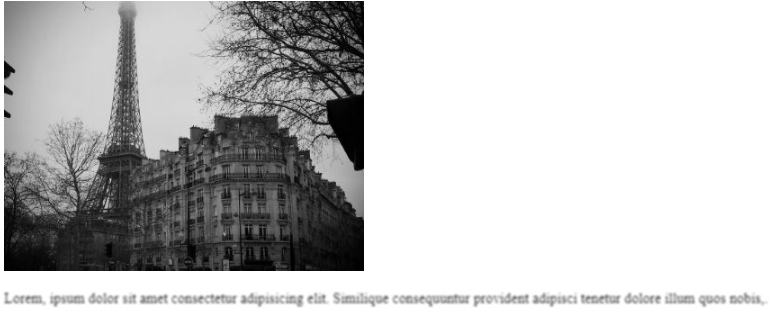

# cour 31 : **``filter``:**


- **Description:**

    >la propriété `filter` permet d'appliquer des effets visuels aux éléments HTML(image , paragraphe ..etc). Cette propriété offre un large éventail d'options pour manipuler la façon dont les éléments sont rendus visuellement. 

- **Valeurs :**

    - **blur()** : Applique un flou à l'élément. La valeur spécifiée indique le niveau de flou à appliquer.
    ```css
    filter: blur(5px);
    ```

    - **grayscale()** : Convertit l'élément en niveaux de gris (noir et blanc ). La valeur spécifiée (entre 0% et 100%) contrôle le niveau de gris.
    ```css
    filter: grayscale(50%);
    ```

    - **invert()** : Inverse les couleurs de l'élément. La valeur spécifiée (entre 0% et 100%) contrôle le niveau d'inversion.
    ```css
    filter: invert(75%);
    ```

- **Exemple:**

    ```css
    img {
        transition: 0.3s;
        filter: grayscale(100%);
    }


    img:hover {
        filter: grayscale(0); 
    }

    p {
        transition: 0.3s;
        filter: blur(1px);
    }


    p:hover {
        filter: blur(0);
    }

    ```


    


