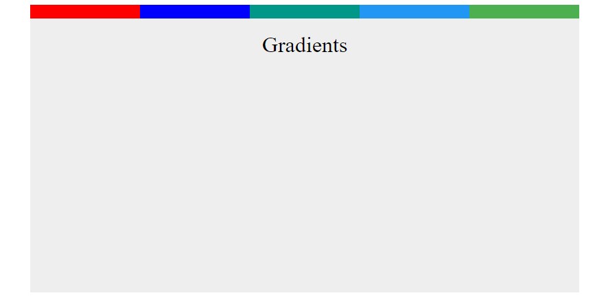

# cour 32 :  **``gradients:``**


# 1. **Introduction:**


>En CSS, les gradients sont des dégradés de couleurs qui peuvent être appliqués à des éléments HTML pour créer des arrière-plans ou des bordures dynamiques et attrayantes. Il existe deux types de gradients en CSS : les gradients linéaires et les gradients radiaux.


## 2 **Gradients Linéaires**

- **Description:**

    >Un gradient linéaire est un dégradé de couleurs qui s'étend dans une direction spécifiée. 
    
- **Syntaxe:**

    ```css
    .linear-gradient {
        background-image: linear-gradient(direction, color1, color2, ...);
    }
    ```

    - `direction` spécifie la direction du dégradé, par exemple `to right`, `to bottom`, `45deg`, etc.
    - `color1`, `color2`, etc. sont les couleurs utilisées dans le dégradé.

- **Exemple :**

    ```css
    div {
        width: 700px;
        height: 200px;
        padding: 10px;
        text-align: center;
        color: white;
        background-image: linear-gradient(to top , red , blue);
    }

    ```

    


## 2. **Gradients Radiaux :**

- **Description:**

    >Un gradient radial est un dégradé de couleurs qui s'étend à partir d'un point central vers l'extérieur. 


- **Syntaxe:**

    ```css
    .radial-gradient {
        background: radial-gradient(shape size at position, color1, color2, ...);
    }
    ```

    - `shape` spécifie la forme du gradient, par exemple `circle` ou `ellipse`.
    - `size` spécifie la taille du gradient, par exemple `closest-side`, `farthest-side`, `closest-corner`, `farthest-corner`.
    - `at position` spécifie la position du centre du gradient.
    - `color1`, `color2`, etc. sont les couleurs utilisées dans le dégradé.

- **Exemple :**

    ```css
    .radial-gradient {
        background-image: radial-gradient(ellipse, #ff0000, #0000ff);
    }
    ```

    


### RQ : Positionnement des couleures

>Dans le cas de la fonction `linear-gradient()` en CSS, vous pouvez spécifier des positions pour chaque couleur pour définir où elles commencent et se terminent dans le dégradé. 


```css
div {
    width: 400px;
    height: 200px;
    background-color: #eee;
    margin: 20px auto;
    position: relative;
    padding: 10px;
    text-align: center;
    /* color: white; */


}


div::before {
    content: "";
    width: 100%;
    height: 10px;
    position: absolute;
    left: 0px;
    top: -10px;
    background-image: linear-gradient(
        to right , 
        red  20%,
        blue 20%  ,
        blue 40%  ,
        #009688 40%,
        #009688 60%,
        #2196f3 60%,
        #2196f3 80%,
        #4caf50 80% 
    );

}
```




