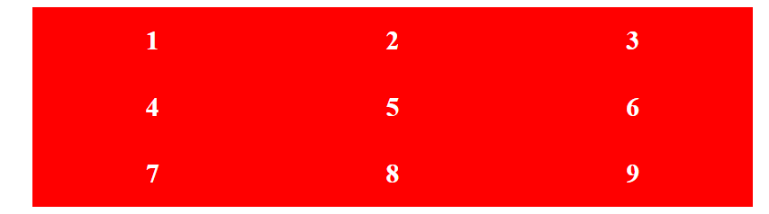

# cour : **``grid``**


## 1. **Introduction:**

- **``grid system``:**

    >Le système de grille (ou grid system en anglais) est un concept fondamental en design, notamment en design web et graphique. Il permet de structurer et d'organiser le contenu de manière cohérente et esthétique sur une page ou une interface. Le système de grille divise l'espace disponible en colonnes et en lignes, créant ainsi une structure régulière sur laquelle les éléments peuvent être placés.


- **``Grid Layout:``**

    >En CSS, le Grid Layout est une fonctionnalité puissante qui permet de créer des mises en page complexes et flexibles. Il offre un contrôle précis sur ``la position`` et ``la taille`` des éléments, tout en étant plus intuitif et flexible que les anciennes méthodes de mise en page CSS comme Floats ou Flexbox.


## 2. **Grid Parent Propriétes:**


### 2.1 **``display : grid``**

- **Description:**

    >Le propriété `display: grid;` en CSS est utilisée pour définir un conteneur comme un conteneur de grille. Une fois que vous avez défini un élément comme un conteneur de grille, vous pouvez placer ses enfants (éléments enfants directs) dans des cellules spécifiques de la grille en utilisant des propriétés comme `grid-row`, `grid-column`, `grid-area`, etc.


- **Exemple:**

    Voici un exemple simple pour illustrer l'utilisation de `display: grid;` :

    ```css
    .container {
        display: grid;
        grid-template-columns: 1fr 1fr 1fr; /* Crée trois colonnes de largeur égale */
        grid-gap: 20px; /* Espacement entre les cellules de la grille */
    }

    .item {
        background-color: #3498db;
        color: white;
        padding: 20px;
        text-align: center;
    }
    ```

    ```html
    <div class="container">
        <div class="item">Item 1</div>
        <div class="item">Item 2</div>
        <div class="item">Item 3</div>
    </div>
    ```

    Dans cet exemple :

    - `.container` est défini comme un conteneur de grille avec `display: grid;`.
    - `grid-template-columns: 1fr 1fr 1fr;` définit trois colonnes de largeur égale.
    - `grid-gap: 20px;` ajoute un espacement de 20 pixels entre les cellules de la grille.
    - Les éléments `.item` sont placés dans les cellules de la grille selon l'ordre dans lequel ils apparaissent dans le HTML.

    


### 2.2 **La propriété `grid-template-columns`**

- **Description**
    
    >La propriété `grid-template-columns` en CSS est utilisée pour définir le nombre et la taille des colonnes dans un conteneur de grille. Cette propriété permet de créer des colonnes de largeurs variables ou égales dans une grille.


- **Syntaxe:**

    La syntaxe de base de `grid-template-columns` est la suivante :

    ```css
    grid-template-columns: valeur1 valeur2 ...;
    ```

    - `valeur1`, `valeur2`, ... : Chaque valeur spécifie la taille ou le comportement d'une colonne. Les valeurs possibles peuvent être des longueurs (`px`, `em`, `%`, etc.), des fractions (`fr`).

- **Valeurs possibles:**

    - **``Longueurs``** : `px`, `em`, `%`, etc. (ex: `grid-template-columns: 100px 200px;`)

    - **`auto`** : La colonne a une largeur automatique basée sur le contenu de ses éléments.
    
    - **`fr`** : Une fraction de l'espace disponible dans le conteneur de grille. Par exemple, `1fr` prendra 1 part de l'espace disponible, `2fr` prendra 2 parts, et ainsi de suite.
    
    - **`repeat(n, valeur)`** : Répète la valeur spécifiée `n` fois pour créer `n` colonnes. Par exemple, `repeat(3, 1fr)` créera 3 colonnes égales de largeur `1fr`.


- **Exemple:**

    ```css
    .parent {
        margin: 20px auto;
        width: 800px;
        height: 200px;
        background-color: #eee;
        display: grid;
        grid-template-columns: repeat(3 , 1fr);
    }


    .parent div {
        background-color: red;
        color: white;
        padding: 20px;
        font-size: 30px;
        font-weight: bold;
        text-align: center;
    }
    ```


    


### 2.3 