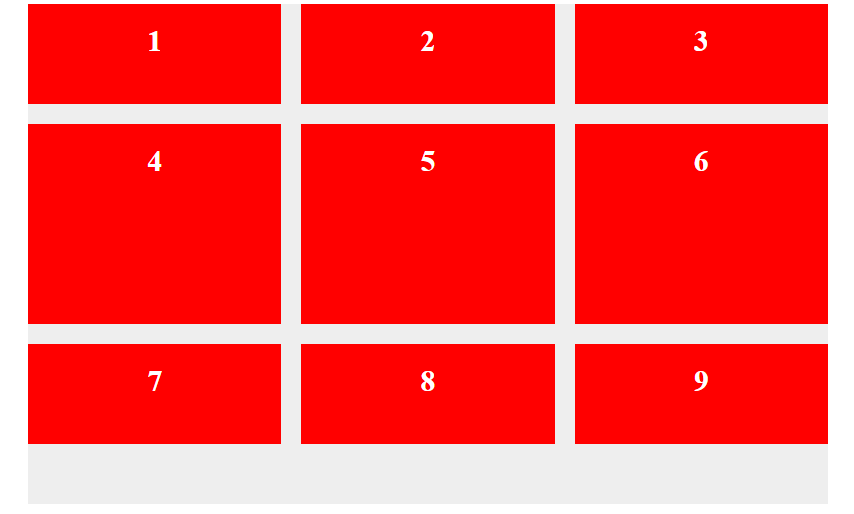
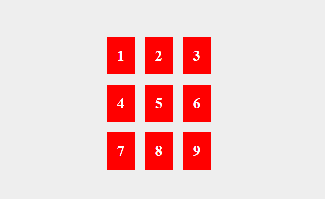
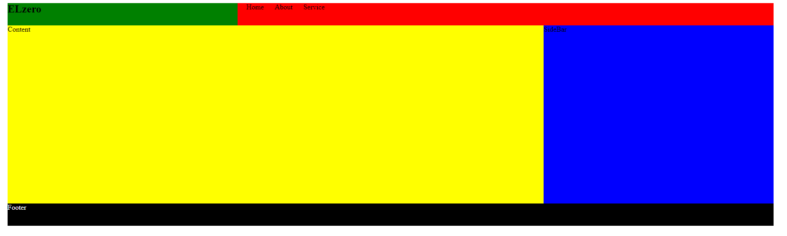
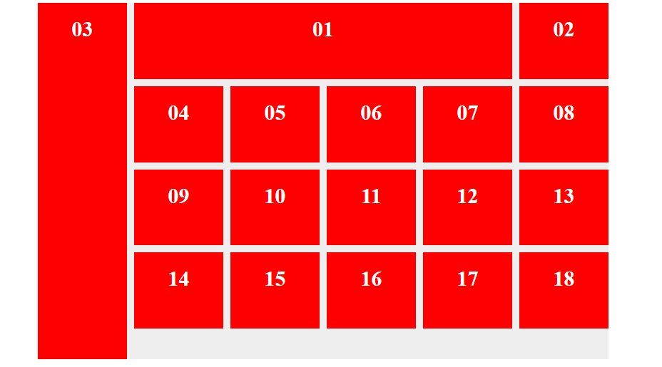

# cour : **``grid``**


## 1. **Introduction:**

- **``grid system``:**

    >Le système de grille (ou grid system en anglais) est un concept fondamental en design, notamment en design web et graphique. Il permet de structurer et d'organiser le contenu de manière cohérente et esthétique sur une page ou une interface. Le système de grille divise l'espace disponible en colonnes et en lignes, créant ainsi une structure régulière sur laquelle les éléments peuvent être placés.


- **``Grid Layout:``**

    >En CSS, le Grid Layout est une fonctionnalité puissante qui permet de créer des mises en page complexes et flexibles. Il offre un contrôle précis sur ``la position`` et ``la taille`` des éléments, tout en étant plus intuitif et flexible que les anciennes méthodes de mise en page CSS comme Floats ou Flexbox.


## 2. **Grid Parent Propriétes:**


### 2.1 **``display : grid``**

- **Description:**

    >Le propriété `display: grid;` en CSS est utilisée pour définir un conteneur comme un conteneur de grille. Une fois que vous avez défini un élément comme un conteneur de grille, vous pouvez placer ses enfants (éléments enfants directs) dans des cellules spécifiques de la grille en utilisant des propriétés comme `grid-row`, `grid-column`, `grid-area`, etc.


- **Exemple:**

    Voici un exemple simple pour illustrer l'utilisation de `display: grid;` :

    ```css
    .container {
        display: grid;
        grid-template-columns: 1fr 1fr 1fr; /* Crée trois colonnes de largeur égale */
        grid-gap: 20px; /* Espacement entre les cellules de la grille */
    }

    .item {
        background-color: #3498db;
        color: white;
        padding: 20px;
        text-align: center;
    }
    ```

    ```html
    <div class="container">
        <div class="item">Item 1</div>
        <div class="item">Item 2</div>
        <div class="item">Item 3</div>
    </div>
    ```

    Dans cet exemple :

    - `.container` est défini comme un conteneur de grille avec `display: grid;`.
    - `grid-template-columns: 1fr 1fr 1fr;` définit trois colonnes de largeur égale.
    - `grid-gap: 20px;` ajoute un espacement de 20 pixels entre les cellules de la grille.
    - Les éléments `.item` sont placés dans les cellules de la grille selon l'ordre dans lequel ils apparaissent dans le HTML.

    


### 2.2 **La propriété `grid-template-columns`**

- **Description**
    
    >La propriété `grid-template-columns` en CSS est utilisée pour définir le nombre et la taille des colonnes dans un conteneur de grille. Cette propriété permet de créer des colonnes de largeurs variables ou égales dans une grille.


- **Syntaxe:**

    La syntaxe de base de `grid-template-columns` est la suivante :

    ```css
    grid-template-columns: valeur1 valeur2 ...;
    ```

    - `valeur1`, `valeur2`, ... : Chaque valeur spécifie la taille ou le comportement d'une colonne. Les valeurs possibles peuvent être des longueurs (`px`, `em`, `%`, etc.), des fractions (`fr`).

- **Valeurs possibles:**

    - **``Longueurs``** : `px`, `em`, `%`, etc. (ex: `grid-template-columns: 100px 200px;`)

    - **`auto`** : La colonne a une largeur automatique basée sur le contenu de ses éléments.
    
    - **`fr`** : Une fraction de l'espace disponible dans le conteneur de grille. Par exemple, `1fr` prendra 1 part de l'espace disponible, `2fr` prendra 2 parts, et ainsi de suite.
    
    - **`repeat(n, valeur)`** : Répète la valeur spécifiée `n` fois pour créer `n` colonnes. Par exemple, `repeat(3, 1fr)` créera 3 colonnes égales de largeur `1fr`.


- **Exemple:**

    ```css
    .parent {
        margin: 20px auto;
        width: 800px;
        height: 200px;
        background-color: #eee;
        display: grid;
        grid-template-columns: repeat(3 , 1fr);
    }


    .parent div {
        background-color: red;
        color: white;
        padding: 20px;
        font-size: 30px;
        font-weight: bold;
        text-align: center;
    }
    ```


    


### 2.3 **La propriété `grid-template-rows`:**

- **Description:**

    >La propriété `grid-template-rows` en CSS est utilisée pour définir le modèle de lignes pour un conteneur de grille. Elle permet de spécifier le nombre, la hauteur  des lignes dans une grille.


- **Syntaxe:**

    La syntaxe de base de `grid-template-rows` est la suivante :

    ```css
    grid-template-rows: valeur1 valeur2 ...;
    ```

    - `valeur1`, `valeur2`, ... : Chaque valeur spécifie la taille ou le comportement d'une ligne. 

- **Valeurs possibles:**

    - **Longueurs** : `px`, `em`, `%`, etc. (ex: `grid-template-rows: 100px 200px;`)
    - **Fractions** : `fr` (ex: `grid-template-rows: 1fr 2fr 1fr;`)
    - **Valeurs minimales** : `min-content`, `minmax(min, max)` (ex: `grid-template-rows: minmax(100px, auto) min-content;`)
    - **Valeurs maximales** : `max-content` (ex: `grid-template-rows: max-content 1fr;`)
    - **Répétition** : `repeat(n, valeur)` (ex: `grid-template-rows: repeat(3, 1fr);`)

- **Exemple:**

    ```css
    .container {
    display: grid;
    grid-template-rows: 100px 200px 300px;
    }
    
    ```

### 2.4 **Les propriétés `row-gap`, `column-gap` et `gap`:**

-  **Description:**

    >Les propriétés `row-gap`, `column-gap` et `gap` en CSS sont utilisées pour définir l'espacement entre les lignes, les colonnes ou les deux dans un conteneur de grille.


- **Syntaxe** :

    ```css
    row-gap: valeur;
    column-gap: valeur;
    gap : valeur1 valeur2;

    ```

    - `valeur1` : espacement entre les lignes
    - `valeur2` : espacement entre les colonnes


- **Exemple** :

    ```css
    .parent {
        margin: 20px auto;
        width: 800px;
        height: 500px;
        background-color: #eee;
        display: grid;
        grid-template-columns: repeat(3 , 1fr);
        grid-template-rows: 100px 200px 100px;
        row-gap: 20px;
        column-gap: 20px;
    }
    ```

    


### 2.5 **Les propriétés `justify-content` et `align-content`:**

>Les propriétés `justify-content` et `align-content` sont utilisées pour aligner et distribuer l'espace supplémentaire dans les conteneurs de grille lorsque l'espace disponible est plus grand que la taille des éléments qu'ils contiennent.


#### a. `justify-content`

- **Description:**

    >La propriété `justify-content` est utilisée pour aligner les éléments le long de l'axe principal (horizontalement dans le cas d'une grille à l'anglaise) d'un conteneur de grille.

- **Syntaxe** :

    ```css
    justify-content: valeur;
    ```

- **Valeurs possibles** :
    - `start` : Alignement au début (par défaut).
    - `end` : Alignement à la fin.
    - `center` : Alignement au centre.
    - `space-between` : Espacement égal entre les éléments.
    - `space-around` : Espacement égal autour des éléments.
    - `space-evenly` : Espacement égal entre et autour des éléments.


#### b. `align-content`:

- **Description:**

    >La propriété `align-content` est utilisée pour aligner les éléments le long de l'axe transversal (verticalement dans le cas d'une grille à l'anglaise) d'un conteneur de grille lorsque l'espace disponible est plus grand que la taille des éléments qu'ils contiennent.


- **Syntaxe** :

    ```css
    align-content: valeur;
    ```
 
- **Valeurs possibles** :

    - `start` : Alignement au début (par défaut).
    - `end` : Alignement à la fin.
    - `center` : Alignement au centre.
    - `space-between` : Espacement égal entre les lignes.
    - `space-around` : Espacement égal autour des lignes.
    - `space-evenly` : Espacement égal entre et autour des lignes.
    - `stretch` : Extension des éléments pour occuper tout l'espace disponible (par défaut).

#### **Exemple** :

```css
.parent {
    margin: 20px auto;
    width: 800px;
    height: 500px;
    background-color: #eee;
    display: grid;
    grid-template-columns: repeat(3 , auto);
    grid-template-rows: repeat(3 , auto);
    row-gap: 20px;
    column-gap: 20px;
    justify-content:center;
    align-content: center;

}
```




### 2.6 **La propriété `grid-template-areas` :**


- **Description:**
 
    >La propriété `grid-template-areas` en CSS est utilisée pour définir un modèle de zone nommé pour un conteneur de grille. Cette propriété permet de créer des mises en page complexes et personnalisées en assignant des noms de zones aux éléments de la grille et en définissant la disposition de ces zones dans le conteneur de grille.


- **Syntaxe:**

    La syntaxe de base de `grid-template-areas` est la suivante :

    ```css
    grid-template-areas: 
        "nom1 nom2 nom3"
        "nom4 nom5 nom6"
        "nom7 nom8 nom9";
    ```

    - `"nom1 nom2 nom3"`, `"nom4 nom5 nom6"`, ... : Ces chaînes représentent les noms de zones pour chaque ligne de la grille. Les noms de zones sont définis à l'aide de chaînes de caractères délimitées par des espaces.


- **Exemple**

    ```css
    .page {

        /* height: 100vh; */
        /* height: 100vh; */
        height: 500px;
        margin: 20px 100px;
        display: grid;
        background-color: #eee;
        grid-template-columns: repeat(10 , 1fr);
        grid-template-rows: 50px auto 50px;
        grid-template-areas: 
            "logo logo logo nav nav nav nav nav nav nav" 
            "cont cont cont cont cont cont cont side side side" 
            "footer footer footer footer footer footer footer footer footer footer";

    }


    h2 {
        grid-area: logo;
        background-color: green;
    }

    nav {
        grid-area: nav;
        background-color: red;
    }


    section {
        grid-area: cont;
        background-color: yellow;
    }

    aside {
        grid-area: side;
        background-color: blue;
    }

    footer {
        grid-area: footer ;
        background: black;
        color: white;
    }
    
    ```

    


## 3. **Child Parent Propriétes:**


### 3.1 **Les propriétés `grid-column` et `grid-row`:**

- **Description:**

    >Les propriétés `grid-column` et `grid-row` en CSS sont utilisées pour positionner et définir la plage de colonnes et de lignes qu'un élément de grille occupe dans un conteneur de grille.

    - La propriété `grid-column` est utilisée pour définir la plage de colonnes qu'un élément de grille occupe.

    - La propriété `grid-row` est utilisée pour définir la plage de lignes qu'un élément de grille occupe.


- **Syntaxe** :

    ```css
    grid-column: début_c / fin_c;
    grid-row: début_l / fin_l;

    ```

    - `début_c` : Numéro de la première colonne que l'élément occupe.
    - `fin_c` : Numéro de la dernière colonne que l'élément occupe.

    - `début_l` : Numéro de la première ligne que l'élément occupe.
    - `fin_l` : Numéro de la dernière ligne que l'élément occupe.


- **Valeurs : ``span``**

    - La valeur `span number` pour la propriété `grid-column`(ou `grid-row`) en CSS est utilisée pour spécifier le nombre de colonnes qu'un élément de grille doit occuper à partir d'une position de départ donnée.


    ```css
    grid-column: début / span number;
    <!-- ou : sans spécifier le début -->
    grid-column: span number;

    ```

    - `début` : Numéro de la première colonne que l'élément occupe.
    - `span number` : Nombre de colonnes que l'élément doit occuper à partir de la position de départ.


- **Exemple** :

    ```css
    .parent {
        margin: 20px auto;
        width: 800px;
        height: 500px;
        background-color: #eee;
        display: grid;
        grid-template-columns: repeat(6 , auto);
        gap: 10px 10px;


    }


    .parent div {
        background-color: red;
        color: white;
        padding: 20px;
        font-size: 30px;
        font-weight: bold;
        text-align: center;
    }


    .one {
        grid-column: 2 / span 4;
    }


    .three  {
        grid-row: 1 / span 5;
    }
    ```

    


### 3.2 **``grid-area:``**


## 4. **minmax() et autofill:**


