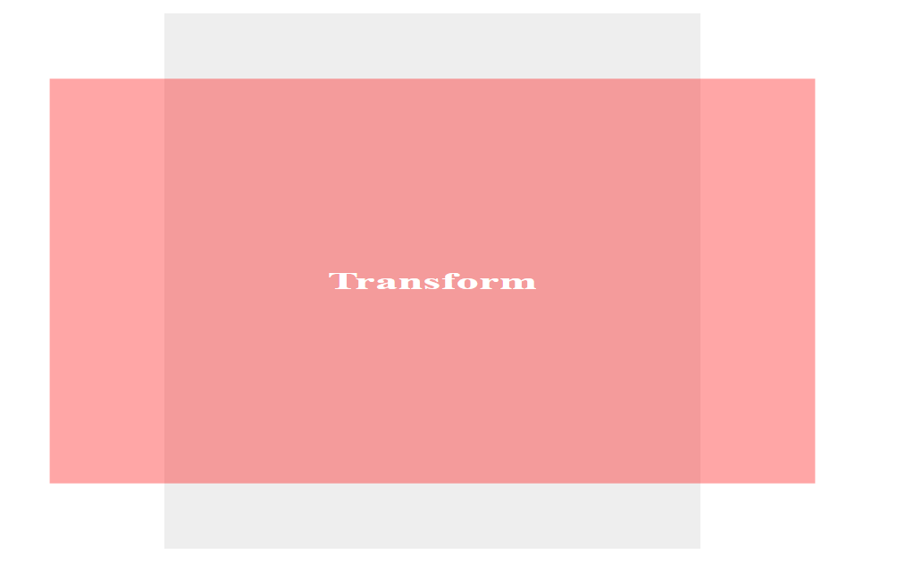
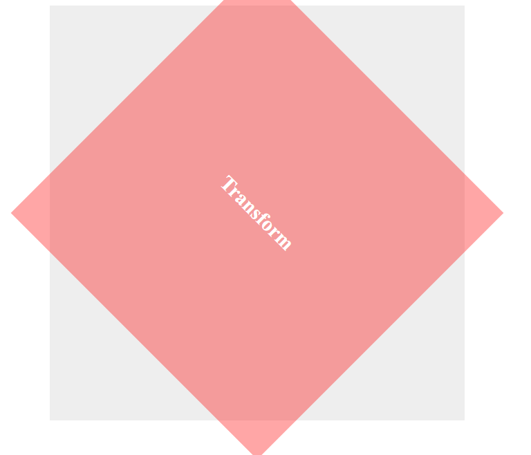
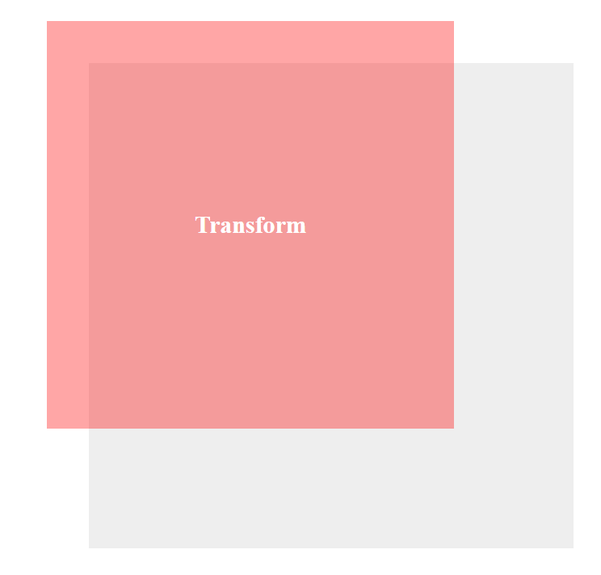
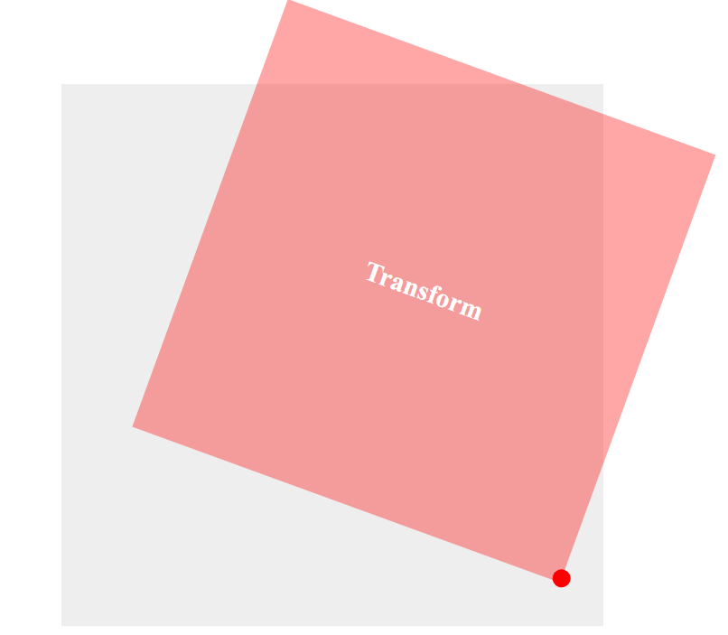
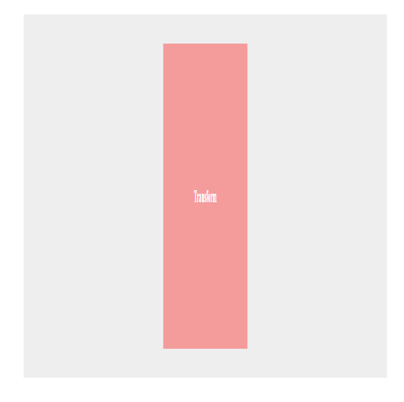
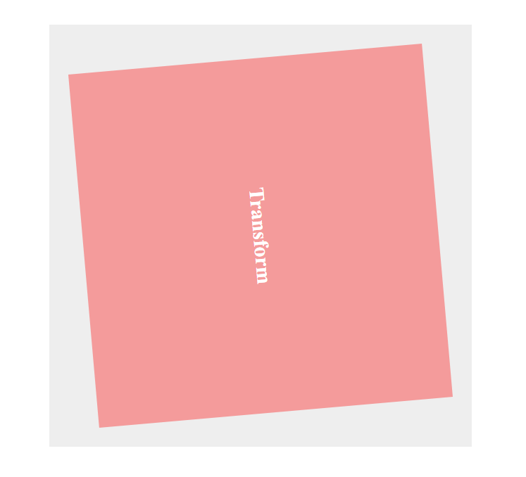
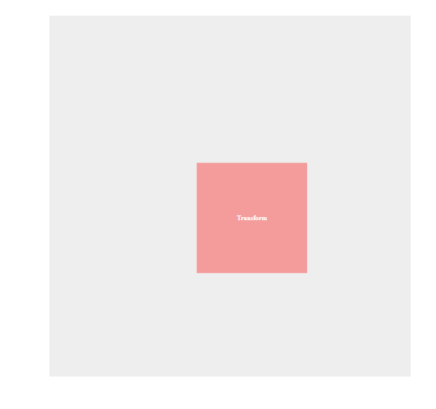
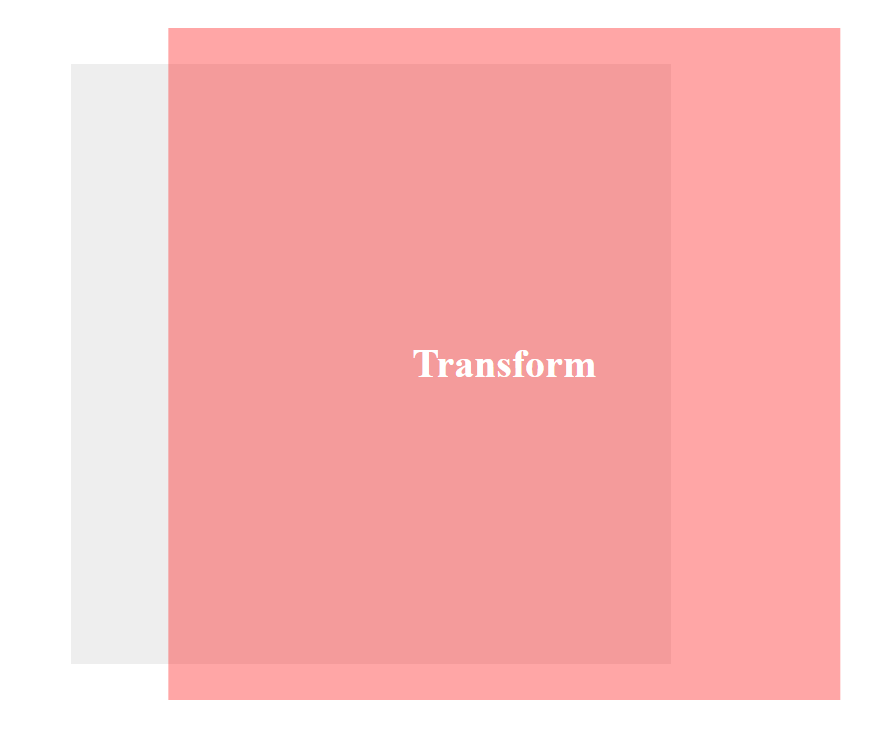

# cour 35 : **``Transformation:``**


## 1.Introduction 

>La propriété CSS `transform` est utilisée pour appliquer des transformations 2D ou 3D à un élément HTML. 


## 2. **``Transformation 2D``:**


### 2.1 **``scale``:**

- **Description:**

    - La propriété `scaleX` permet de changer la taille d'un élément horizontalement sans affecter sa taille verticale. Elle accepte une valeur numérique ou un pourcentage.

    - La propriété `scaleY` permet de changer la taille d'un élément verticalement sans affecter sa taille horizontale. Elle accepte également une valeur numérique ou un pourcentage.

    - La propriété `scale` permet de changer la taille d'un élément à la fois horizontalement et verticalement. Elle prend deux valeurs : la première pour l'échelle horizontale (x) et la seconde pour l'échelle verticale (y).


- **Syntaxe**:
    ```css
    transform: scaleX(valeur);
    <!-- ou :  -->
    transform: scaleY(valeur);
    <!-- ou : -->
    transform: scale(valeurX, valeurY);
    ```

    - `valeur`: La valeur numérique ou le pourcentage par lequel l'élément doit être mis à l'échelle horizontalement.
    - `valeurX`: La valeur numérique ou le pourcentage par lequel l'élément doit être mis à l'échelle horizontalement.
    - `valeurY`: La valeur numérique ou le pourcentage par lequel l'élément doit être mis à l'échelle verticalement.
        
    - si la valeur du ``scaleX`` est négative l'élément sera reflété horizontalement.
    - si la valeur du ``scaleY`` est négative l'élément sera reflété verticalement.
    - Si vous utilisez une valeur négative pour les deux axes (scaleX et scaleY), l'élément sera reflété à la fois horizontalement et verticalement ce qui revient à inverser l'élément.


- **Exemple**:

    ```css
    .spahe {
        background-color: #eee;
        width: 600px;
        height: 600px;
        margin: 20px auto;
        padding: 20px;


    }

    .spahe > div {
        background-color: rgba(255, 0, 0, 0.349);
        width: 90%;
        height: 90%;

        font-size: 30px;
        font-weight: bold;
        color: white;

        display: flex;
        align-items: center;
        justify-content: center;

        margin-top: 5%;
        margin-left: 5%;

        transition: .5s;

        transform:scale(1.7 , 0.9);

    }
    ```


    


### 2.2 **``rotate``:**


- **Description:**

    >La fonction `rotate()` permet de faire pivoter un élément d'un certain nombre de degrés spécifié. Les valeurs positives représentent une rotation dans le sens des aiguilles d'une montre, tandis que les valeurs négatives représentent une rotation dans le sens inverse des aiguilles d'une montre.

- **Syntaxe**:
    ```css
    transform: rotate(angle);
    ```

    - `angle`: L'angle de rotation en degrés (ou rad , grad , turn). Vous pouvez utiliser des valeurs positives ou négatives.

- **Exemple**:

    ```css
    .shape > div {
        transform: rotate(45deg);
    }
    ```
    


### 2.3 **``translate``:**

- **Description:**
    
    >La fonction `translate()` déplace un élément selon les coordonnées spécifiées en pixels ou en pourcentage. Elle prend deux valeurs : la première pour la translation horizontale (axe X) et la seconde pour la translation verticale (axe Y).

- **Syntaxe:**
    La syntaxe générale de la fonction `translate()` est la suivante :
    ```css
    transform: translate(<tx>, <ty>);
    ```
    où :
    - `<tx>` est la valeur de translation horizontale, exprimée en pixels (`px`), pourcentage (`%`), ou d'autres unités de mesure valides.
    - `<ty>` est la valeur de translation verticale, exprimée de la même manière que `<tx>`.

- **Exemple:**

    ```css
    .spahe > div {
        background-color: rgba(255, 0, 0, 0.349);
        width: 90%;
        height: 90%;

        font-size: 30px;
        font-weight: bold;
        color: white;

        display: flex;
        align-items: center;
        justify-content: center;

        margin-top: 5%;
        margin-left: 5%;

        transition: .5s;

        transform: translate(-100px , -100px );
    }

    ```


    


### 2.4 **``skew``:**

- **Description:**

    >La fonction `skew()` en CSS est utilisée pour incliner un élément selon un angle spécifié autour de l'axe X et/ou de l'axe Y. Elle permet de déformer visuellement l'élément en lui donnant une apparence inclinée.


- **Syntaxe:**

    La syntaxe générale de la fonction `skew()` est la suivante :
    ```css
    transform: skew(<sx>, <sy>);
    ```
    où :
    - `<sx>` est l'angle de l'inclinaison autour de l'axe X, exprimé en degrés.
    - `<sy>` est l'angle de l'inclinaison autour de l'axe Y, exprimé en degrés (facultatif).

- **Exemple:**

    ```css
    h2 {
        color: white;
        margin: 20px auto;
        padding: 20px;
        position: relative;
        width: fit-content;

    }

    h2::before {
        content: '';
        width: 100%;
        height: 100%;
        top: 0;
        left: 0;
        position: absolute;
        background: red;
        transform: skew(-20deg);
        z-index: -1;
    }
    ```

    


### 2.5 **``matrix``:**

- **Description:**

    >La fonction `matrix()` en CSS permet d'appliquer une transformation 2D complexe à un élément en utilisant une matrice de transformation. Cette fonction est très puissante, car elle peut combiner plusieurs transformations en une seule en utilisant une matrice .

- **Syntaxe:**

    La syntaxe générale de la fonction `matrix()` est la suivante :
    ```css
    transform: matrix(a, b, c, d, tx, ty);
    ```

    - `a` et `d` sont les coefficients pour  ``scaleX()`` et ``sacleY()``.
    - `b` et `c` sont les coefficients pour ``skewY()`` et ``skewX()``.
    - `tx` et `ty` sont les valeurs de translation horizontale et verticale( ``translateX()`` et ``translateY()`` ).

- **Exemple:**

    ```css
    transform: matrix(1, 0.5, 0.5, 1, 50, 50);
    ```


### 2.6 **``transform-origin``:**

- **Description:**

    >La propriété ``transform-origin`` en CSS permet de définir le point d'origine autour duquel une transformation ``transform`` sera appliquée à un élément. Par défaut, le point d'origine est le centre de l'élément, mais avec transform-origin, vous pouvez déplacer ce point vers d'autres positions.

- **Syntaxe**:

    ```css
    transform-origin: x y;
    ```

    - `x`: La position horizontale du point d'origine. Vous pouvez utiliser des valeurs en pixels, pourcentages ou mots-clés (`left`, `center`, `right`).
    - `y`: La position verticale du point d'origine. Vous pouvez utiliser des valeurs en pixels, pourcentages ou mots-clés (`top`, `center`, `bottom`).

- **Exemple :**

    ```css

    .spahe > div {
        background-color: rgba(255, 0, 0, 0.349);
        width: 90%;
        height: 90%;

        font-size: 30px;
        font-weight: bold;
        color: white;

        display: flex;
        align-items: center;
        justify-content: center;

        margin-top: 5%;
        margin-left: 5%;

        transition: .5s;

        transform-origin: right bottom;
        transform: rotate(20deg);


        position: relative;
    }


    .spahe > div::before {
        content: '';
        position: absolute;
        bottom: -5px;
        left: 98%;
        width: 20px;
        height: 20px;
        border-radius: 50%;
        background-color: red;

    }


    ```


    

#### Remarque :

- La fonction `matrix()` est puissante, mais elle peut être complexe à utiliser directement. Habituellement, elle est générée par des outils ou des scripts plutôt que d'être écrite manuellement. En pratique, si vous avez besoin d'effectuer des transformations simples comme la translation, la rotation ou l'inclinaison, il est souvent plus simple et plus lisible d'utiliser les fonctions `translate()`, `rotate()` et `skew()` respectivement.

- l'ordre des transformations dans la propriété `transform` en CSS est crucial. Les transformations sont appliquées dans l'ordre où elles apparaissent, de gauche à droite , et si on change l'ordre on trouve des résultat différents (en math $fog \neq gof$ ).


## 3. **``Transformation 3D``:**

### 3.1 **``Rotate :``**

- **Description:**

    >Les transformations 3D en CSS offrent des moyens supplémentaires pour manipuler les éléments dans un espace tridimensionnel. Vous pouvez utiliser les fonctions `rotateX()`, `rotateY()`, `rotateZ()` et `rotate3d()` pour effectuer des rotations autour des axes X, Y, Z ou un axe personnalisé.

    - La fonction `rotateX()` permet de faire pivoter un élément autour de l'axe X.
    - La fonction `rotateY()` permet de faire pivoter un élément autour de l'axe Y.
    - La fonction `rotateZ()` est équivalente à la fonction `rotate()` pour les transformations 2D, elle permet de faire pivoter un élément autour de l'axe Z.
    - La fonction `rotate3d()` permet de faire pivoter un élément autour d'un axe personnalisé dans l'espace tridimensionnel.


- **Syntaxe :**

    ```css
    transform: rotateX(<angle>);
    <!--  -->
    transform: rotateY(<angle>);
    <!--  -->
    transform: rotateZ(<angle>);
    <!--  -->
    transform: rotate3d(<x>, <y>, <z>, <angle>);
    ```

    - `<x>`, `<y>`, `<z>` : Les composantes du vecteur de rotation. Elles définissent l'axe autour duquel la rotation aura lieu (0 , 1).
    - `<angle>` : L'angle de rotation, en degrés.

- **Exemple :**

    - **``transform : rotateX(85deg):``**

        


    - **``transform : rotateY(85deg):``**

        


    - **``transform : rotateZ(85deg):``**

        


### 3.2 **`perspective` et `perspective-origin`:**


- **Description:**

    >Les propriétés `perspective` et `perspective-origin` en CSS sont utilisées pour créer des effets de perspective sur les éléments 3D. Ces propriétés sont souvent utilisées en conjonction avec les transformations 3D pour donner l'illusion de profondeur et de distance dans un espace tridimensionnel.

    -  La propriété `perspective` définit la distance à laquelle l'observateur voit l'élément. Elle crée un effet de profondeur pour **les transformations 3D appliquées aux éléments enfants** .

    - La propriété `perspective-origin` définit le point d'origine de la perspective autour duquel les transformations 3D sont appliquées. Elle détermine le point de vue de l'observateur sur l'élément.


- **Syntaxe :**

    ```css
    perspective: <length>|none;
    <!--  -->
    perspective-origin: <x-position> <y-position>;
    ```

    - `<length>` : La distance de la perspective (en px , ..etc). 

    - `x`: La position horizontale du point d'origine de la perspective. Vous pouvez utiliser des valeurs en pixels, pourcentages ou mots-clés (`left`, `center`, `right`).
    - `y`: La position verticale du point d'origine de la perspective . Vous pouvez utiliser des valeurs en pixels, pourcentages ou mots-clés (`top`, `center`, `bottom`).

- **Exemples :**


    ```css
    .parent {
    perspective: 1000px;
    perspective-origin: 50% 50%;
    }

    .child {
    transform: rotateY(45deg);
    }
    ```

    Dans cet exemple :
    - La propriété `perspective` est définie sur `1000px`, ce qui crée un effet de perspective à cette distance pour les transformations 3D des éléments enfants.
    - La propriété `perspective-origin` est définie au centre (`50% 50%`) de l'élément parent.
    - L'élément enfant est incliné de `45deg` autour de l'axe Y grâce à la transformation `rotateY()`.

### 3.3 **``Translation 3D:``**

- **Description:**
    
    >La fonction `translate3d()` en CSS est une extension de la fonction `translate()` qui permet de déplacer un élément dans un espace tridimensionnel. Alors que la fonction `translate()` déplace un élément uniquement sur les axes X et Y, la fonction `translate3d()` permet de déplacer un élément sur les axes X, Y et Z.


- **Syntaxe:**

    ```css
    transform: translate3d(tx, ty, tz);
    ```

- **Exemple:**

    ```css

    * {
        box-sizing: border-box;
    }
    .parent {
        background-color: #eee;
        width: 600px;
        height: 600px;
        margin: 100px auto;
        padding: 20px;

        perspective: 200px;
        perspective-origin: center center;


    }

    .parent > div {
        background-color: rgba(255, 0, 0, 0.349);
        width: 90%;
        height: 90%;

        font-size: 30px;
        font-weight: bold;
        color: white;

        display: flex;
        align-items: center;
        justify-content: center;

        margin-top: 5%;
        margin-left: 5%;

        transition: .5s;

        transform: translate3d(100px , 100px, -350px);
        <!-- ou  -->
        <!-- transform: translate3d(100px , 0px, 50px); -->


    }

    ```

    

    


## 4. **Propriétés utiles en 3D:**


### 4.1 **``backface-visibility:``**

- **Description:**

    >La propriété `backface-visibility` en CSS contrôle la visibilité de la face arrière (face cachée) d'un élément lorsque celui-ci est incliné ou retourné avec des transformations 3D. 


- **Syntaxe:**

    ```css
        backface-visibility: visible|hidden;
    ```
    - `visible` : La face arrière est visible.
    - `hidden` : La face arrière est cachée et n'est pas rendue.


- **Exemple :**


    Lorsque `backface-visibility` est défini sur `hidden`, la face arrière de l'élément sera cachée et ne sera pas rendue.

    ```css
    .hidden-backface {
    transform: rotateY(180deg);
    backface-visibility: hidden;
    }
    ```

    Dans cet exemple, si l'élément avec la classe `.hidden-backface` est incliné ou retourné avec `rotateY(180deg)`, la face arrière ne sera pas visible.

- **Utilisation courante:**

    La propriété `backface-visibility` est souvent utilisée avec des animations et des transformations 3D pour améliorer les performances et l'aspect visuel des éléments. Elle est particulièrement utile pour créer des animations de cartes retournables, des transitions de page ou d'autres effets où l'élément change de direction et où la face arrière n'est pas nécessairement visible.

    ```css
    .card {
    transition: transform 0.5s ease;
    }

    .card:hover {
    transform: rotateY(180deg);
    backface-visibility: hidden;
    }
    ```

    Dans cet exemple, lorsqu'un élément avec la classe `.card` est survolé, il est retourné avec `rotateY(180deg)` et la face arrière est cachée grâce à `backface-visibility: hidden;`, créant ainsi un effet de carte retournable fluide.


### 4.2 **`transform-style`:**

- **Description:**

    >La propriété `transform-style` en CSS est utilisée pour spécifier comment les enfants d'un élément 3D sont rendus en relation avec l'élément parent lors de l'utilisation de transformations 3D. Cette propriété est particulièrement utile lorsque vous avez des éléments enfants qui subissent des transformations 3D et que vous souhaitez déterminer comment ces transformations doivent être rendues.


-  **Syntaxe:**

    ```css
    transform-style: flat|preserve-3d;
    ```

    - `flat`: Les éléments enfants sont rendus dans le même plan que l'élément parent, ignorant les transformations 3D des éléments enfants.
    - `preserve-3d`: Les transformations 3D des éléments enfants sont préservées et rendues comme si elles étaient effectuées dans un espace tridimensionnel distinct.

- **Exemple:**

    ```css
    .parent {
    transform-style: preserve-3d;
    }

    .child {
    transform: rotateY(45deg);
    }
    ```

    Dans cet exemple, l'élément enfant avec la classe `.child` subit la transformation `rotateY(45deg)`, et cette transformation est préservée et rendue en tant que telle, comme si elle était effectuée dans un espace 3D distinct.

