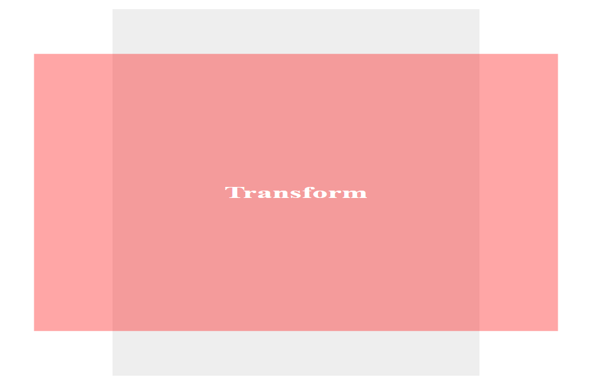
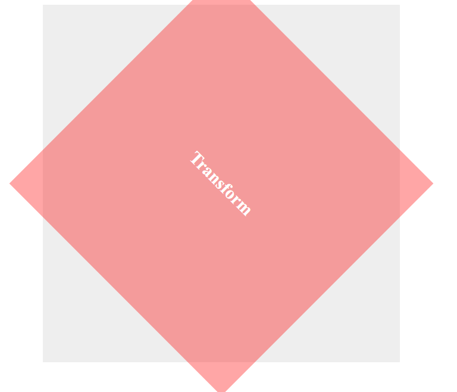

# cour 35 : **``Transformation:``**


## 1.Introduction 

>La propriété CSS `transform` est utilisée pour appliquer des transformations 2D ou 3D à un élément HTML. 


## 2. **``Transformation 2D``:**


### 2.1 **``scale``:**

- **Description:**

    - La propriété `scaleX` permet de changer la taille d'un élément horizontalement sans affecter sa taille verticale. Elle accepte une valeur numérique ou un pourcentage.

    - La propriété `scaleY` permet de changer la taille d'un élément verticalement sans affecter sa taille horizontale. Elle accepte également une valeur numérique ou un pourcentage.

    - La propriété `scale` permet de changer la taille d'un élément à la fois horizontalement et verticalement. Elle prend deux valeurs : la première pour l'échelle horizontale (x) et la seconde pour l'échelle verticale (y).


- **Syntaxe**:
    ```css
    transform: scaleX(valeur);
    <!-- ou :  -->
    transform: scaleY(valeur);
    <!-- ou : -->
    transform: scale(valeurX, valeurY);
    ```

    - `valeur`: La valeur numérique ou le pourcentage par lequel l'élément doit être mis à l'échelle horizontalement.
    - `valeurX`: La valeur numérique ou le pourcentage par lequel l'élément doit être mis à l'échelle horizontalement.
    - `valeurY`: La valeur numérique ou le pourcentage par lequel l'élément doit être mis à l'échelle verticalement.
        
    - si la valeur du ``scaleX`` est négative l'élément sera reflété horizontalement.
    - si la valeur du ``scaleY`` est négative l'élément sera reflété verticalement.
    - Si vous utilisez une valeur négative pour les deux axes (scaleX et scaleY), l'élément sera reflété à la fois horizontalement et verticalement ce qui revient à inverser l'élément.


- **Exemple**:

    ```css
    .spahe {
        background-color: #eee;
        width: 600px;
        height: 600px;
        margin: 20px auto;
        padding: 20px;


    }

    .spahe > div {
        background-color: rgba(255, 0, 0, 0.349);
        width: 90%;
        height: 90%;

        font-size: 30px;
        font-weight: bold;
        color: white;

        display: flex;
        align-items: center;
        justify-content: center;

        margin-top: 5%;
        margin-left: 5%;

        transition: .5s;

        transform:scale(1.7 , 0.9);

    }
    ```


    


### 2.2 **``rotate``:**


- **Description:**

    >La fonction `rotate()` permet de faire pivoter un élément d'un certain nombre de degrés spécifié. Les valeurs positives représentent une rotation dans le sens des aiguilles d'une montre, tandis que les valeurs négatives représentent une rotation dans le sens inverse des aiguilles d'une montre.

- **Syntaxe**:
    ```css
    transform: rotate(angle);
    ```

    - `angle`: L'angle de rotation en degrés (ou rad , grad , turn). Vous pouvez utiliser des valeurs positives ou négatives.

- **Exemple**:

    ```css
    .shape > div {
        transform: rotate(45deg);
    }
    ```
    


### 2.3 **``translate``:**


### 2.4 **``skew``:**


### 2.5 **``matrix``:**


### 2.6 **``transform-origin``:**


Par défaut, l'élément pivote autour de son centre. Vous pouvez spécifier un point d'origine différent en utilisant les propriétés `transform-origin`.

**Syntaxe**:
```css
transform-origin: x y;
```

- `x`: La position horizontale du point d'origine. Vous pouvez utiliser des valeurs en pixels, pourcentages ou mots-clés (`left`, `center`, `right`).
- `y`: La position verticale du point d'origine. Vous pouvez utiliser des valeurs en pixels, pourcentages ou mots-clés (`top`, `center`, `bottom`).

**Exemple avec un point d'origine**:
```css
.transform-example {
  transform: rotate(45deg);
  transform-origin: top left;
}
```
Dans cet exemple, l'élément sera pivoté de 45 degrés autour du coin supérieur gauche de son conteneur.


## 3. **``Transformation 3D``:**