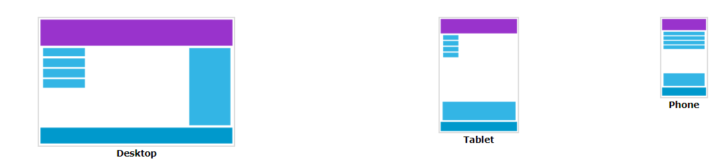

# cour : **Media-queires :**


### 1. **Introduction:**


>Les media queries et le responsive design sont des concepts fondamentaux en développement web moderne qui permettent d'adapter l'apparence et la mise en page d'un site web en fonction des caractéristiques de l'appareil sur lequel il est affiché, comme la taille de l'écran, l'orientation, la résolution, etc.


- Le responsive design est une approche de conception web qui vise à créer des sites web qui s'adaptent automatiquement et élégamment à différents dispositifs et tailles d'écran. Plutôt que de créer plusieurs versions distinctes d'un site web pour différents appareils, le responsive design utilise des techniques comme les media queries pour ajuster dynamiquement la mise en page et les styles en fonction des besoins de l'utilisateur.




## 2. **``@media:``**

- **Description:**

    >Les media queries sont des règles CSS qui permettent de cibler des styles spécifiques en fonction des caractéristiques du dispositif d'affichage. Elles permettent de vérifier des critères tels que la largeur de l'écran, la hauteur, l'orientation, le type de dispositif (par exemple, écran ou impression), et bien d'autres.


- **Syntaxe:**

    La syntaxe de base des media queries en CSS est la suivante :

    ```css
    @media type and (feature: value) {
        /* Styles à appliquer si la media query est vraie */
    }
    <!-- ou -->
    @media (feature-1: value-1) and (feature-2: value-2) {
        /* Styles à appliquer si la media query est vraie */
    }
    ```

    - **type** : C'est le type de média que vous souhaitez cibler : `screen` (écran), `print` (impression), `speech` (synthèse vocale) et `all` (tous les types).

    - **feature** : Il s'agit de la caractéristique que vous souhaitez vérifier : `max-width`, `min-width`, `orientation`, `resolution`.

    - **value** : C'est la valeur de la caractéristique que vous souhaitez vérifier. Par exemple, pour `max-width: 768px`, `768px` est la valeur.


- **Exemple 1:**

    Cibler les impressions

    ```css
    @media print {
        /* Styles à appliquer */
        body {
            font-size : 30px ; 
        }
    }
    ```


- **Exemple 2:**

    Cibler les écrans de moins de 768px de largeur :

    ```css
    @media screen and (max-width: 768px) {
        /* Styles à appliquer */
    }
    ```

- **Exemple 3 :**

    Voici un exemple de media query combinant plusieurs conditions :

    ```css
    @media screen and (min-width: 768px) and (max-width: 1024px) {
        /* Styles à appliquer pour les écrans de 768px à 1024px de largeur */
    }
    ```


## 3. **Attribut ``media`` :**

- **Description:**

    >L'attribut `media` est utilisé dans les balises `<link>` et `<style>` en HTML pour spécifier à quel type de média les styles CSS doivent s'appliquer. Cela permet de conditionner l'application des styles à des dispositifs spécifiques ou à des contextes d'affichage particuliers.


- **Utilisation avec la balise `<link>`:**

    - L'attribut `media` dans la balise `<link>` est souvent utilisé pour lier des feuilles de style spécifiques à certains types de médias. 
    
    - **Voici un exemple :**

        ```html
        <!DOCTYPE html>
        <html>
        <head>
            <title>Exemple de media queries avec link</title>
            
            <!-- Feuille de style pour les écrans -->
            <link rel="stylesheet" href="styles.css" media="screen">

            <!-- Feuille de style pour l'impression -->
            <link rel="stylesheet" href="print.css" media="print">
        </head>
        <body>
            <!-- Contenu de la page -->
        </body>
        </html>
        ``` 
        Dans cet exemple, `styles.css` sera appliqué uniquement aux écrans (`media="screen"`) et `print.css` sera appliqué uniquement lors de l'impression (`media="print"`).

- **Utilisation avec la balise `<style>`:**

    - L'attribut `media` peut également être utilisé dans la balise `<style>` pour encapsuler des media queries directement dans votre document HTML. 
    
    - **Voici un exemple :**

        ```html
        <!DOCTYPE html>
        <html>
        <head>
            <title>Exemple de media queries avec style</title>
            <style media="screen and (max-width : 768px)">
                /* Styles pour les écrans */
                body {
                    background-color: lightgrey;
                }
            </style>
            <style media="print">
                /* Styles pour l'impression */
                body {
                    background-color: white;
                    color: black;
                }
            </style>
        </head>
        <body>
            <!-- Contenu de la page -->
        </body>
        </html>
        ```


### RQ : **Standard width-media:**

```css

/* Mobile */
@media (max-width : 767px) {
    
}

/* Small Screen */

@media (min-width : 768px) and (max-width : 991px) {
    

}

/* Meduim Screen  */

@media (min-width : 992px) {
    
}

/* Large Screen  */

@media (min-width : 1200px ) {
    
}

```