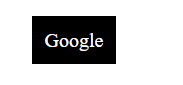

# Exercice 04 : button

- L'objectif est de créer un bouton simple qui pointe vers un lien google.com, et si l'on survole ce bouton, il y a un changement visuel :

- **bouton:** 

    

- **si on survole sur ce bouton:**
    
    