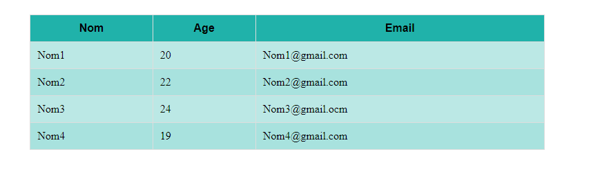

# Exercice 05 : 

- **Objetcif:**

    >L'objectif de cet exercice est de créer un tableau en HTML et d'améliorer son apparence en utilisant du CSS afin d'optimiser l'expérience utilisateur (UX).

    
    

- **lien:**

    [mise_en_forme_tab](https://juliencrego.com/exercices/mise-en-forme-dun-tableau-en-css-css10/)
