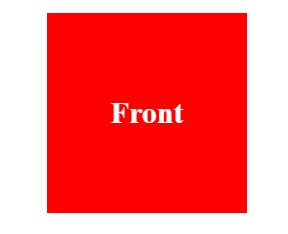
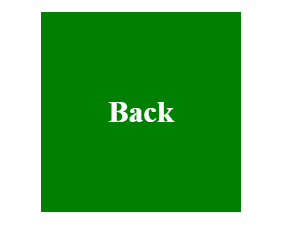

# Exercice 15 :


>**L'objectif de cet exercice est de créer une animation 3D. Lorsque l'utilisateur survole la partie 'front', une rotation 3D est déclenchée, révélant ainsi la 'Partie Back'. La 'Partie Front' est alors cachée**






- **partie ``HTML``:**

```html
<div class="container">
    <div class="box">
        <div class="face front">Front</div>
        <div class="face back">Back</div>
    </div>
</div>

```

- vous pouvez utilisez les propriétes CSS : `transfrom` , `transition` , `position` , `backface-visibility` ,`transfrom-style` , `flex`